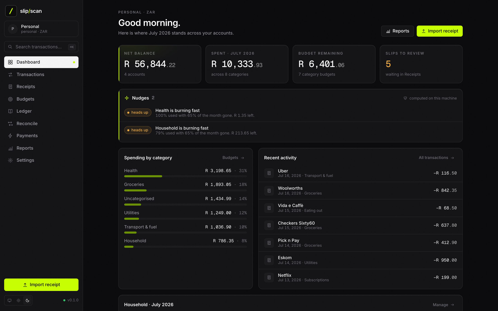
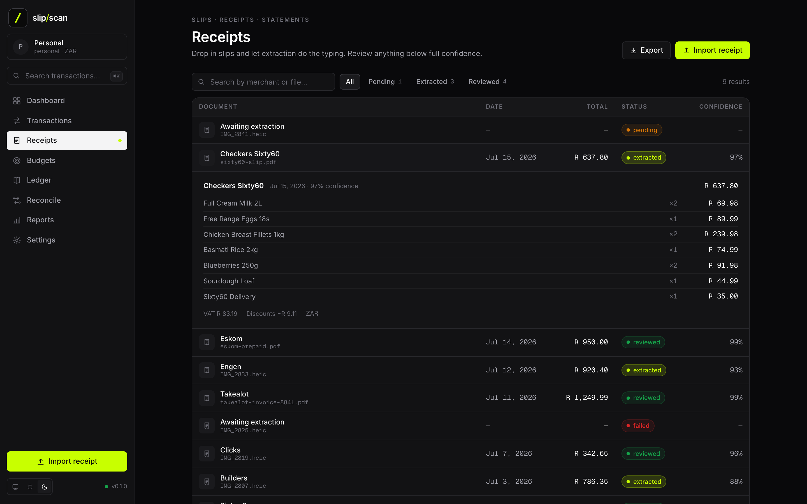
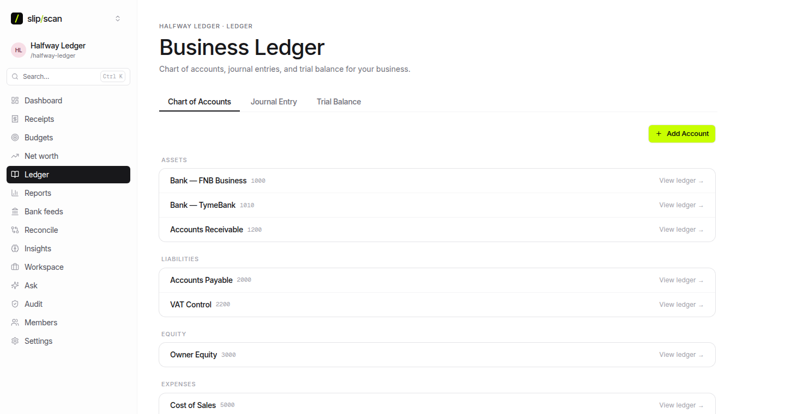
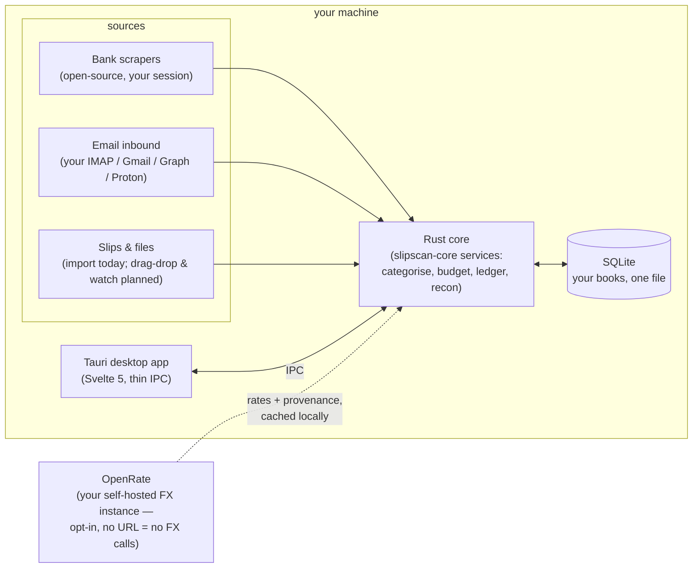
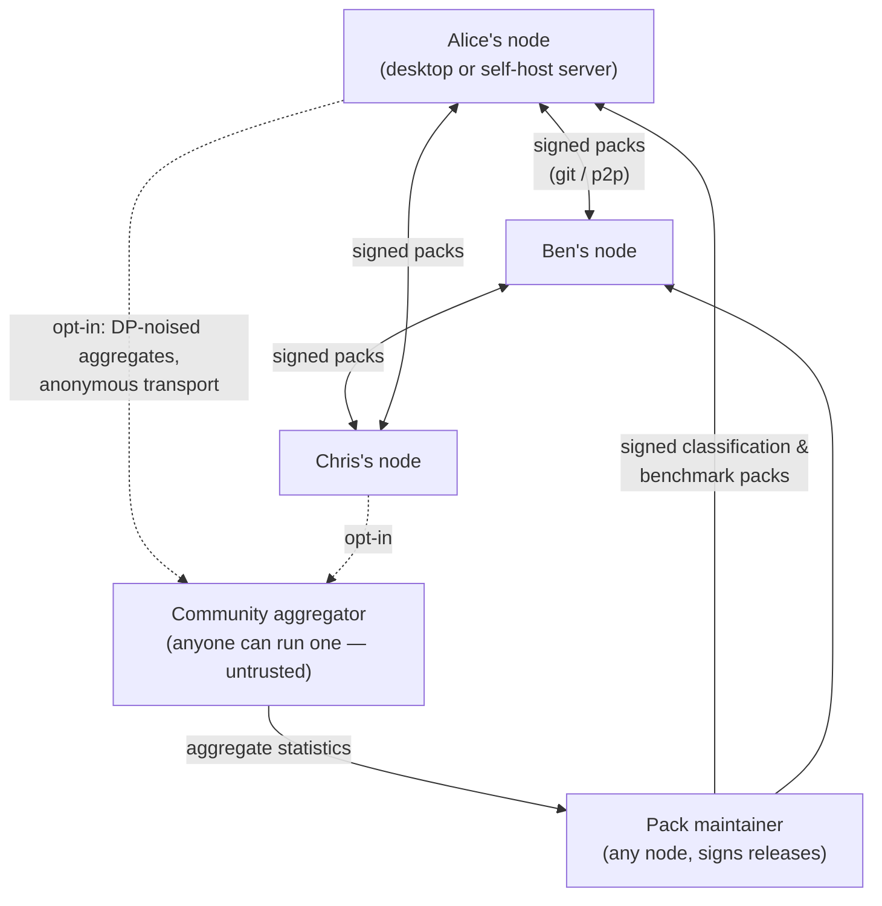

<p align="center">
  <picture>
    <source media="(prefers-color-scheme: dark)" srcset="assets/brand/logo-wordmark-dark.svg">
    
  </picture>
</p>

<p align="center"><strong>Self-hosted, decentralized personal finance &amp; accounting. You are the server.</strong></p>

<p align="center">
  <a href="#quick-start">Quick start</a> ·
  <a href="#features">Features</a> ·
  <a href="#screenshots">Screenshots</a> ·
  <a href="#how-it-works">How it works</a> ·
  <a href="#documentation">Docs</a> ·
  <a href="ROADMAP.md">Roadmap</a>
</p>

<!-- Plain-text badges on purpose: rendering this README triggers no external
     image fetches — the same no-default-network-calls ethos as the app. -->
<p align="center"><sub><a href="LICENSE">MIT license</a> · Rust 1.85+ · Tauri 2 · SQLite · offline-first</sub></p>

<p align="center">
  
  <br>
  <sub><em>Design direction — an archived capture of the legacy cloud app, kept as the visual target (<a href="docs/SCREENSHOTS.md">honest notes</a>). Shots of the shipped desktop app replace these as screens are finished.</em></sub>
</p>

<table align="center">
  <tr>
    <td align="center" width="33%"><strong>You are the server</strong><br><sub>No SaaS backend, no aggregator in the middle. Everything runs on your machine or a box you control.</sub></td>
    <td align="center" width="33%"><strong>Write-only secrets</strong><br><sub>Bank &amp; mailbox credentials live in your OS keychain. Set, rotate, revoke, use — never view.</sub></td>
    <td align="center" width="33%"><strong>Share smarts, not data</strong><br><sub>Community knowledge travels as signed classification packs — with noise-protected benchmark statistics designed on the same principle (<a href="docs/BENCHMARKS.md">not yet built</a>). Never your transactions.</sub></td>
  </tr>
</table>

## What is SlipScan?

SlipScan gives you what Vault22 / 22seven does for personal finance and what Xero does for small-business accounting — bank transactions, receipts, budgets, categorised spending, double-entry ledger, reconciliation, tax — with one fundamental difference: **there is no central server**. A Rust core over a plain SQLite file, wrapped in a Tauri desktop app. It is a standalone product: no account, no cloud, no telemetry, and it never depends on any hosted service.

It is also **global by default**: nothing country-specific is hardcoded — chart-of-accounts seeds, tax rates and return labels, bank CSV presets, and merchant packs all ship as **region profiles** (data you pick, [contract](docs/ARCHITECTURE.md#global-by-default--regions-are-data-not-code)). South Africa is the first region profile; a generic profile covers any country from day one.

Your data lives on your machine, your bank and mailbox credentials stay in your OS keychain, and the only thing the community shares is knowledge — signed classification packs today, with differentially-private benchmark statistics designed but [not yet implemented](docs/BENCHMARKS.md) — never data.

## Features

<table>
  <tr>
    <th align="left" width="50%">💰 Personal finance <sub>(Vault22 / 22seven class)</sub></th>
    <th align="left" width="50%">📒 Accounting <sub>(Xero class)</sub></th>
  </tr>
  <tr>
    <td valign="top">
      <ul>
        <li>Accounts across banks — bank, cash, card, asset, liability</li>
        <li>Transaction categorisation with local corrections and merchant mappings — the learning loop never leaves your machine; community pack <em>rules</em> install today but are not yet consulted during categorisation (<a href="docs/PACKS.md">status</a>)</li>
        <li>Per-category monthly budgets, spending breakdowns and income/expense reports (a rollover flag is stored per budget, but rollover is not yet applied to the numbers)</li>
        <li>Receipt/slip capture with LLM/OCR extraction (line items, discounts, VAT) — bring your own key or run a local model</li>
        <li>Local nudge engine and anonymous peer benchmarks — designed, in progress (<a href="docs/BENCHMARKS.md">how it stays private</a>)</li>
      </ul>
    </td>
    <td valign="top">
      <ul>
        <li>Double-entry ledger: chart of accounts, journals, balanced-by-construction journal lines</li>
        <li>Chart-of-accounts seeds, tax rates, tax-period summaries, and returns groundwork from your <em>region profile</em> — South Africa first, generic profile everywhere else</li>
        <li>Bank reconciliation: suggested matches between documents, transactions, and journal lines</li>
        <li>Trial balance, income statement, balance sheet, and CSV export</li>
        <li>Immutable posted journals — corrections are reversals, never edits</li>
      </ul>
    </td>
  </tr>
</table>

**Infrastructure you can trust**

- Your books in one plain SQLite file, at a path you can see, back up, and move
- Ingestion from your own mailbox — always your accounts, [never our infrastructure](docs/EMAIL.md); generic IMAP polling works today, Gmail/Graph connectors and push are built but not yet wired to a surface
- Open-source, local bank-scraper framework — adapters run in your session, first adapters in progress ([framework](docs/BANK-ADAPTERS.md))
- Write-only credential vault rooted in the OS keychain — secrets can be set, rotated, revoked, and used, never viewed ([threat model](docs/THREAT-MODEL.md))
- Opt-in multi-currency FX via [OpenRate](https://github.com/vul-os/openrate) — self-hosted, provenance-graded rates (quality grade + as-of age shown wherever a converted amount is), cached locally, every conversion recording the rate it used; no endpoint configured means zero FX network calls ([contract](docs/ARCHITECTURE.md#exchange-rates--openrate); integration lands in Phase 4.7)
- Headless self-host server mode for an always-on box ([guide](docs/SELFHOST.md))

> [!NOTE]
> **Status: pre-0.1, under active development.** The Rust core, CLI, extraction, ingestion, packs, and server crates are implemented; bank adapters, nudges/benchmarks, and device sync are tracked phase-by-phase in [ROADMAP.md](ROADMAP.md).

## Screenshots

These are **design-direction previews** — the target UI the desktop app is being built toward. Some depict legacy cloud-era concepts that are not coming back (workspaces, members, sign-in); the full annotated set with honest notes is in [docs/SCREENSHOTS.md](docs/SCREENSHOTS.md).

<table>
  <tr>
    <td width="50%"><br><sub><em>Receipts — capture, extraction status, review queue</em></sub></td>
    <td width="50%"><br><sub><em>Slip detail — line items, categories, VAT</em></sub></td>
  </tr>
  <tr>
    <td width="50%"><br><sub><em>Double-entry ledger — journals and chart of accounts</em></sub></td>
    <td width="50%"><br><sub><em>Reconciliation — suggested matches, one-click confirm</em></sub></td>
  </tr>
</table>

## Quick start

> [!IMPORTANT]
> There are no binary releases or Docker images yet — you build from source. Prerequisites (Rust stable, Node 20+, Tauri system deps) are listed in [docs/GETTING-STARTED.md](docs/GETTING-STARTED.md).

```sh
git clone https://github.com/vul-os/slipscan
cd slipscan

# Desktop app
cd apps/desktop && npm install && npm run tauri dev

# Core library + CLI (headless)
cargo build --workspace
cargo run -p slipscan-cli -- init --name "Personal" --kind personal
cargo run -p slipscan-cli -- --help    # import, extract, mail-sync, recon, report, pack, vault, serve, list
```

`slipscan serve` binds `127.0.0.1` unless you explicitly pass `--lan` — see [docs/SELFHOST.md](docs/SELFHOST.md).

## How it works

Everything runs on your machine. Sources feed one Rust core, the core owns a plain SQLite database holding your books, and the desktop app is a thin shell over the same services. The only network endpoints in the picture are ones **you** configured — your bank, your mailbox, your LLM provider, and (opt-in, for multi-currency) your own [OpenRate](https://github.com/vul-os/openrate) instance for provenance-graded FX rates:



Between machines there is no hub — every node is a self-hosted peer. The only things that ever cross the network are **signed packs** (taxonomies and rules, verified with ed25519 on install) and, for users who opt in, **differentially-private aggregates** — category-level statistics noised on-device before they leave it. Aggregators are community-run and untrusted by design; transactions, merchants, and credentials never appear on any edge:



Reading benchmark packs is perfectly private — comparison happens locally. Contributing is off by default, anonymous, and lossy by design: [docs/BENCHMARKS.md](docs/BENCHMARKS.md).

## Configuration

Settings live in SQLite, secrets live in the OS keychain, and there is no required config file — the full model, data locations, and every setting key are in [docs/CONFIGURATION.md](docs/CONFIGURATION.md).

## Documentation

| Document | What it covers |
|---|---|
| [GETTING-STARTED.md](docs/GETTING-STARTED.md) | Clone to first book: build, import, capture a slip, connect a mailbox, pick an LLM provider |
| [ARCHITECTURE.md](docs/ARCHITECTURE.md) | The binding contract: layout, tech decisions, domain model, vault spec, non-negotiables |
| [CONFIGURATION.md](docs/CONFIGURATION.md) | Settings model, data locations, environment |
| [API.md](docs/API.md) | One service surface, two transports — Tauri IPC and the `/api/v1` HTTP server |
| [EMAIL.md](docs/EMAIL.md) | Email ingestion: IMAP IDLE, Gmail, Microsoft Graph, Proton Bridge — your accounts, no middleman |
| [BANK-ADAPTERS.md](docs/BANK-ADAPTERS.md) | The local, open-source bank-scraper framework and how to write an adapter |
| [PACKS.md](docs/PACKS.md) | Signed classification packs: format, signing, verification, distribution |
| [BENCHMARKS.md](docs/BENCHMARKS.md) | Nudges and anonymous peer benchmarks: local DP, cohorts, honest limits |
| [SELFHOST.md](docs/SELFHOST.md) | Running the core headless on a NAS / home server |
| [THREAT-MODEL.md](docs/THREAT-MODEL.md) | What protects your credentials, what an attacker gets, residual risks |
| [SCREENSHOTS.md](docs/SCREENSHOTS.md) | Visual tour: design direction and current state |
| [FAQ.md](docs/FAQ.md) | Straight answers to the questions everyone asks |

Also: [ROADMAP.md](ROADMAP.md) (phases, with honest partial-status notes; parity matrices are planned there but not yet written), [SECURITY.md](SECURITY.md) (vulnerability reporting), [CHANGELOG.md](CHANGELOG.md).

## Development

```sh
# Rust workspace
cargo build --workspace
cargo test --workspace
cargo fmt --all -- --check
cargo clippy --workspace --all-targets

# Desktop app
cd apps/desktop
npm install
npm run check          # svelte-check
npm run tauri dev      # run against the real core
```

The workspace denies `unsafe_code`; money is `i64` minor units, never floats; secrets never appear in logs, `Debug` impls, or IPC responses. Read [docs/ARCHITECTURE.md](docs/ARCHITECTURE.md) before changing anything structural — it is the contract.

## Contributing

Contributions are welcome — bank adapters, mailbox providers, and classification packs especially. See [CONTRIBUTING.md](CONTRIBUTING.md), and [docs/BANK-ADAPTERS.md](docs/BANK-ADAPTERS.md#writing-an-adapter) for the adapter checklist.

## License

[MIT](LICENSE)
