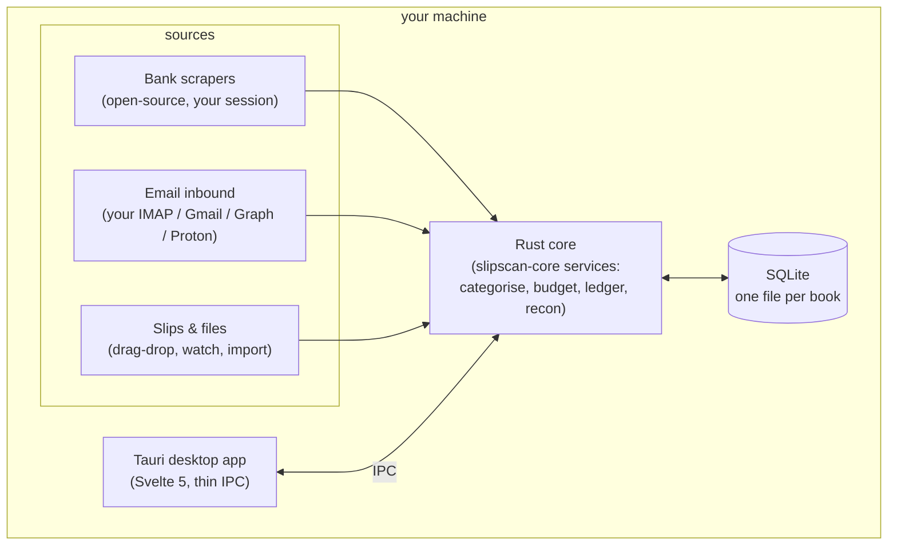
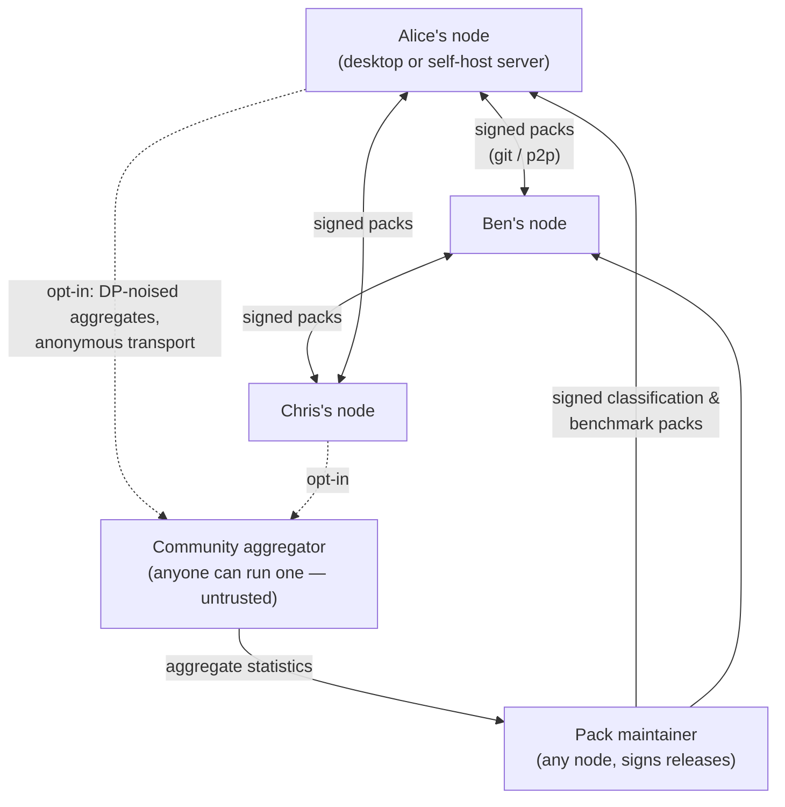

<p align="center">
  <picture>
    <source media="(prefers-color-scheme: dark)" srcset="assets/brand/logo-wordmark-dark.svg">
    
  </picture>
</p>

<p align="center"><strong>Self-hosted, decentralized personal finance &amp; accounting. You are the server.</strong></p>

<p align="center"><sub> Part of <strong><a href="https://vulos.org">VulOS</a></strong> — the open, self-hostable web OS &amp; app suite. Runs standalone, or as an app hosted by the Vulos OS.</sub></p>

<p align="center">
  <a href="LICENSE"></a>
  
  
</p>

<p align="center">
  
</p>

## What is SlipScan?

SlipScan gives you what Vault22 / 22seven does for personal finance and what Xero does for small-business accounting — bank transactions, receipts, budgets, categorised spending, double-entry ledger, reconciliation, VAT — with one fundamental difference: **there is no central server**. A Rust core over a plain SQLite file, wrapped in a Tauri desktop app. Your data lives on your machine, your bank and mailbox credentials stay in your OS keychain, and the only thing the community shares is knowledge — signed classification packs and differentially-private benchmark statistics — never data.

## Part of VulOS

**Vulos = free, open-source software + two paid services.** The Vulos OS, all its apps, and the app store are OSS and free — you self-host them. Users self-provision and self-pay their own box (Fly / Hetzner / any VPS / home server); Vulos does not host or provision boxes. Vulos bills for only two things: **Vulos Relay** (reachability — the sovereign connectivity fabric) and **backup storage** (buckets). There is no compute/box billing, no mail billing, and no app-store subscription.

VulOS is an open, self-hostable web OS + app suite. The **Vulos OS** is the shell (launcher, windows, dock, assistant) that hosts the apps; each product is also independently self-hostable on its own:

- **Vulos OS** — the web-native desktop shell that hosts the apps
- **Vulos Office** — documents: docs, sheets, slides, PDF, and whiteboards (an Office document type)
- **Vulos Files** — file storage + P2P sharing, built into the OS
- **Vulos Relay** — sovereign connectivity / reachability fabric (`@vulos/relay-client`) — one of the two paid services
- **llmux** — sovereign AI gateway

PIM is bring-your-own via **lilmail** (connect-your-own-mailbox mail/calendar/contacts engine); comms are third-party open protocols (Matrix/Element, Element Call / Jitsi).

**SlipScan is the family's personal-finance &amp; accounting product.** It runs standalone **and** is hosted as an app by the Vulos OS — and, per its own [roadmap](ROADMAP.md#non-goals), it never depends on VulOS or on any hosted service: no account, no cloud, no telemetry.

## Features

**Personal finance (Vault22 / 22seven class)**

- Accounts across banks — bank, cash, card, asset, liability
- Automatic transaction categorisation: rules from community packs + local corrections (the learning loop never leaves your machine)
- Per-category monthly budgets with rollover; spending breakdowns and income/expense reports
- Receipt/slip capture with LLM/OCR extraction (line items, discounts, VAT) — bring your own key or run a local model
- Local nudge engine and anonymous peer benchmarks — designed, in progress ([how it stays private](docs/BENCHMARKS.md))

**Accounting (Xero class)**

- Double-entry ledger: chart of accounts, journals, balanced-by-construction journal lines
- VAT rates, VAT summaries, and returns groundwork
- Bank reconciliation: suggested matches between documents, transactions, and journal lines
- Trial balance and CSV export

**Infrastructure you can trust**

- One SQLite file per book, at a path you can see, back up, and move
- Ingestion from your own mailbox (IMAP IDLE, Gmail, Microsoft Graph, Proton Bridge — always your accounts, [never our infrastructure](docs/EMAIL.md))
- Open-source, local bank-scraper framework — adapters run in your session, first adapters in progress ([framework](docs/BANK-ADAPTERS.md))
- Write-only credential vault rooted in the OS keychain — secrets can be set, rotated, revoked, and used, never viewed ([threat model](docs/THREAT-MODEL.md))
- Headless self-host server mode for an always-on box ([guide](docs/SELFHOST.md))

Status: pre-0.1, under active development — the Rust core, CLI, extraction, ingestion, packs, and server crates are implemented; bank adapters, nudges/benchmarks, and device sync are tracked phase-by-phase in [ROADMAP.md](ROADMAP.md).

## Screenshots

Full tour with commentary in [docs/SCREENSHOTS.md](docs/SCREENSHOTS.md).

| | |
|---|---|
|  *Receipts — capture, extraction status, review queue* |  *Slip detail — line items, categories, VAT* |
|  *Double-entry ledger — journals and chart of accounts* |  *Reconciliation — suggested matches, one-click confirm* |
|  *Ask — plain-language questions over your own data, BYO LLM* | |

## Quick start (standalone)

There are no binary releases or Docker images yet — you build from source. Prerequisites (Rust stable, Node 20+, Tauri system deps) are listed in [docs/GETTING-STARTED.md](docs/GETTING-STARTED.md).

```sh
git clone https://github.com/vul-os/slipscan
cd slipscan

# Desktop app
cd apps/desktop && npm install && npm run tauri dev

# Core library + CLI (headless)
cargo build --workspace
cargo run -p slipscan-cli -- init --name "Personal" --kind personal
cargo run -p slipscan-cli -- --help    # import, extract, mail-sync, recon, report, pack, vault, serve, list
```

`slipscan serve` binds `127.0.0.1` unless you explicitly pass `--lan` — see [docs/SELFHOST.md](docs/SELFHOST.md).

## How it works

Everything runs on your machine. Sources feed one Rust core, the core owns one SQLite file per book, and the desktop app is a thin shell over the same services:



Between machines there is no hub — every node is a self-hosted peer. The only things that ever cross the network are **signed packs** (taxonomies and rules, verified with ed25519 on install) and, for users who opt in, **differentially-private aggregates** — category-level statistics noised on-device before they leave it. Aggregators are community-run and untrusted by design; transactions, merchants, and credentials never appear on any edge:



Reading benchmark packs is perfectly private — comparison happens locally. Contributing is off by default, anonymous, and lossy by design: [docs/BENCHMARKS.md](docs/BENCHMARKS.md).

## Configuration

Settings live in SQLite, secrets live in the OS keychain, and there is no required config file — the full model, data locations, and every setting key are in [docs/CONFIGURATION.md](docs/CONFIGURATION.md).

## Documentation

| Document | What it covers |
|---|---|
| [GETTING-STARTED.md](docs/GETTING-STARTED.md) | Clone to first book: build, import, capture a slip, connect a mailbox, pick an LLM provider |
| [ARCHITECTURE.md](docs/ARCHITECTURE.md) | The binding contract: layout, tech decisions, domain model, vault spec, non-negotiables |
| [CONFIGURATION.md](docs/CONFIGURATION.md) | Settings model, data locations, environment |
| [API.md](docs/API.md) | One service surface, two transports — Tauri IPC and the `/api/v1` HTTP server |
| [EMAIL.md](docs/EMAIL.md) | Email ingestion: IMAP IDLE, Gmail, Microsoft Graph, Proton Bridge — your accounts, no middleman |
| [BANK-ADAPTERS.md](docs/BANK-ADAPTERS.md) | The local, open-source bank-scraper framework and how to write an adapter |
| [PACKS.md](docs/PACKS.md) | Signed classification packs: format, signing, verification, distribution |
| [BENCHMARKS.md](docs/BENCHMARKS.md) | Nudges and anonymous peer benchmarks: local DP, cohorts, honest limits |
| [SELFHOST.md](docs/SELFHOST.md) | Running the core headless on a NAS / home server |
| [THREAT-MODEL.md](docs/THREAT-MODEL.md) | What protects your credentials, what an attacker gets, residual risks |
| [SCREENSHOTS.md](docs/SCREENSHOTS.md) | Visual tour of the app |
| [FAQ.md](docs/FAQ.md) | Straight answers to the questions everyone asks |

Also: [ROADMAP.md](ROADMAP.md) (phases and parity matrices), [SECURITY.md](SECURITY.md) (vulnerability reporting), [CHANGELOG.md](CHANGELOG.md).

## Development

```sh
# Rust workspace
cargo build --workspace
cargo test --workspace
cargo fmt --all -- --check
cargo clippy --workspace --all-targets

# Desktop app
cd apps/desktop
npm install
npm run check          # svelte-check
npm run tauri dev      # run against the real core
```

The workspace denies `unsafe_code`; money is `i64` minor units, never floats; secrets never appear in logs, `Debug` impls, or IPC responses. Read [docs/ARCHITECTURE.md](docs/ARCHITECTURE.md) before changing anything structural — it is the contract.

## Contributing

Contributions are welcome — bank adapters, mailbox providers, and classification packs especially. See [CONTRIBUTING.md](CONTRIBUTING.md), and [docs/BANK-ADAPTERS.md](docs/BANK-ADAPTERS.md#writing-an-adapter) for the adapter checklist.

## License

[MIT](LICENSE)
