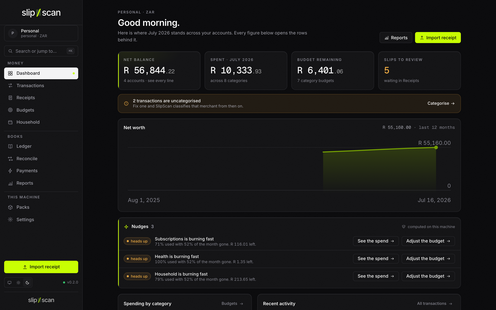
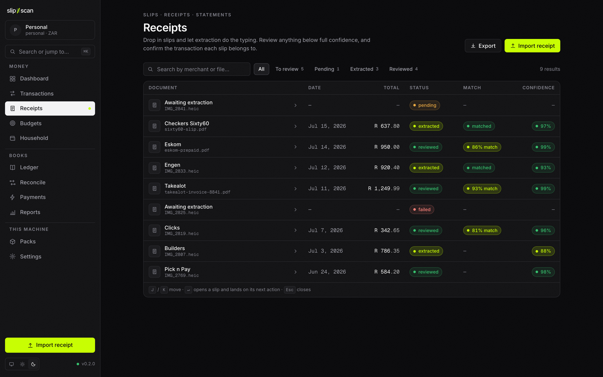
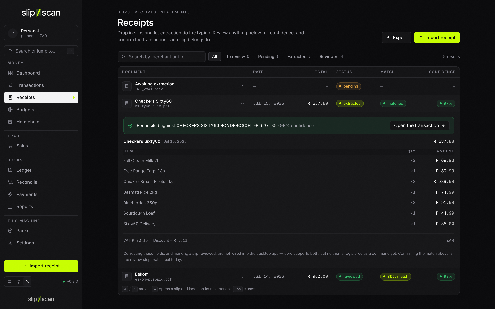
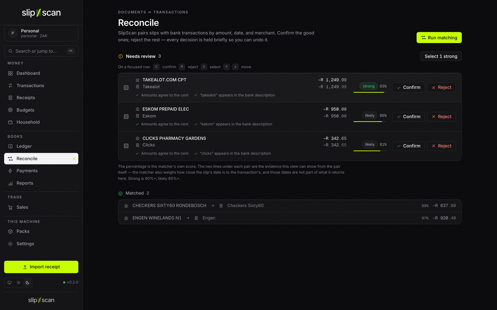
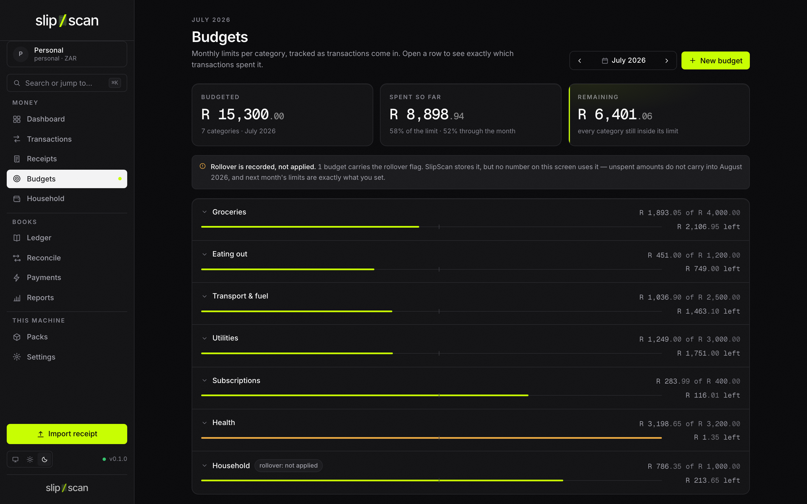
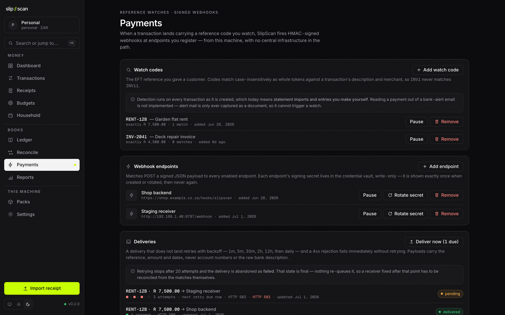
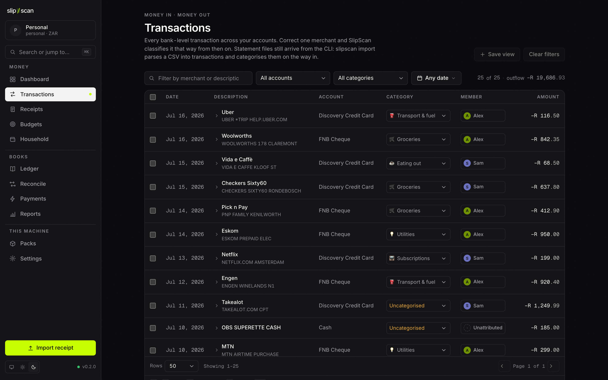
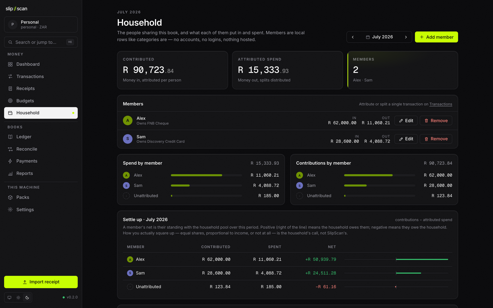
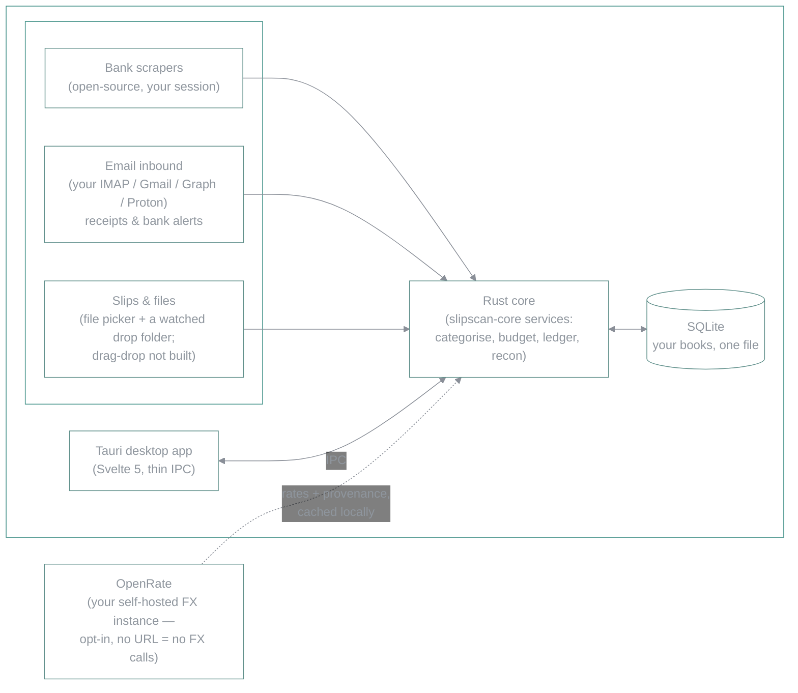
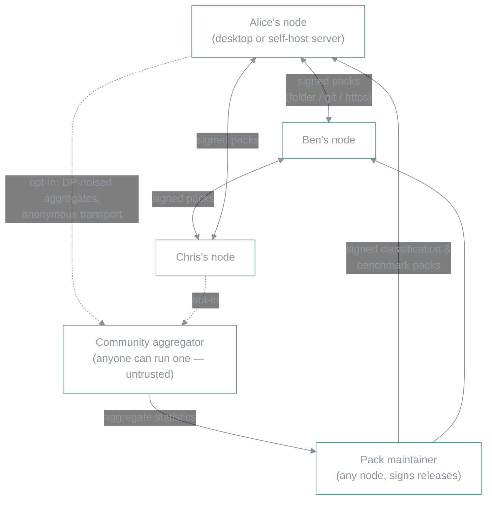

<p align="center">
  <picture>
    <source media="(prefers-color-scheme: dark)" srcset="assets/brand/logo-wordmark-dark.svg">
    
  </picture>
</p>

<p align="center"><strong>Self-hosted, decentralized personal finance &amp; accounting. You are the server.</strong></p>

<p align="center">
  <a href="#quick-start">Quick start</a> ·
  <a href="#download">Download</a> ·
  <a href="#features">Features</a> ·
  <a href="#screenshots">Screenshots</a> ·
  <a href="#how-it-works">How it works</a> ·
  <a href="#documentation">Docs</a> ·
  <a href="PARITY.md">Parity</a> ·
  <a href="ROADMAP.md">Roadmap</a>
</p>

<!-- Plain-text badges on purpose: rendering this README triggers no external
     image fetches — the same no-default-network-calls ethos as the app. -->
<p align="center"><sub><a href="LICENSE-MIT">MIT</a> OR <a href="LICENSE-APACHE">Apache-2.0</a> · Rust 1.85+ · Tauri 2 · SQLite · offline-first</sub></p>

<p align="center">
  
  <br>
  <sub><em>The shipped desktop app — Dashboard with net balance, monthly spend, budget remaining, locally-computed nudges, and recent activity. All screenshots show demo data (<a href="docs/SCREENSHOTS.md">full tour</a>).</em></sub>
</p>

<table align="center">
  <tr>
    <td align="center" width="33%"><strong>You are the server</strong><br><sub>No SaaS backend, no aggregator in the middle. Everything runs on your machine or a box you control.</sub></td>
    <td align="center" width="33%"><strong>Write-only secrets</strong><br><sub>Bank &amp; mailbox credentials live in your OS keychain. Set, rotate, revoke, use — never view.</sub></td>
    <td align="center" width="33%"><strong>Share smarts, not data</strong><br><sub>Community knowledge travels as signed packs — over a folder, a USB stick, a git remote or HTTPS, with no registry in the middle. Benchmark statistics are designed on the same principle; reading one is local, and <a href="docs/BENCHMARKS.md">contributing is not built</a>. Never your transactions.</sub></td>
  </tr>
</table>

## What is SlipScan?

SlipScan is aiming at what Vault22 / 22seven does for personal finance and what Xero does for small-business accounting — bank transactions, receipts, budgets, categorised spending, double-entry ledger, reconciliation, tax — with one fundamental difference: **there is no central server**. A Rust core over a plain SQLite file, wrapped in a Tauri desktop app. It is a standalone product: no account, no cloud, no telemetry, and it never depends on any hosted service.

**How much of that is actually built?** [PARITY.md](PARITY.md) scores all 24 capabilities on both axes — Built / Partial / Not built, each with a file-level citation. The short version: the personal-finance loop is real (accounts, categorisation that learns, budgets, household attribution); the accounting side now has invoicing, quotes and a fixed-asset register — **there is still no distinct bill/accounts-payable entity, no aged payables, and no payroll**. Nothing in that document is rounded up.

It is also **global by default**: nothing country-specific is hardcoded — chart-of-accounts seeds, tax rates and return labels, bank CSV presets, and merchant packs all ship as **region profiles** (data you pick, [contract](docs/ARCHITECTURE.md#global-by-default--regions-are-data-not-code)). South Africa is the first region profile; a generic profile covers any country from day one.

Your data lives on your machine, your bank and mailbox credentials stay in your OS keychain, and the only thing the community shares is knowledge — signed classification packs today, with differentially-private benchmark statistics designed but [not yet implemented](docs/BENCHMARKS.md) — never data.

## Features

<table>
  <tr>
    <th align="left" width="50%">💰 Personal finance <sub>(Vault22 / 22seven class)</sub></th>
    <th align="left" width="50%">📒 Accounting <sub>(Xero class)</sub></th>
  </tr>
  <tr>
    <td valign="top">
      <ul>
        <li>Accounts across banks — bank, cash, card, asset, liability</li>
        <li>Transaction categorisation with local corrections and merchant mappings — the learning loop never leaves your machine; community pack <em>rules</em> are consulted only for merchants your book has no opinion about, so your corrections always win — exact rules apply on every surface, the rest inside a process that has installed a pack (<a href="docs/PACKS.md">status</a>)</li>
        <li>Per-category monthly budgets, spending breakdowns and income/expense reports (a rollover flag is stored per budget, but rollover is not yet applied to the numbers)</li>
        <li>Receipt/slip capture with LLM/OCR extraction (line items, discounts, VAT) — bring your own key or run a local model</li>
        <li>Household members &amp; per-person attribution — split spend across the people sharing a book, with per-member expense/contribution reports and a "who owes whom" settle-up view; members are local data, not logins</li>
        <li>Local nudge engine — budget drift, duplicate charges and recurring-subscription detection are computed on your own data and surface on the Dashboard; the category-spike, fee-creep and tax-deadline tiers are not built. Peer benchmarks compare you against a signed pack <em>locally</em> (nothing is transmitted), but no benchmark pack is published yet, and contributing to one is <a href="docs/BENCHMARKS.md">designed and unbuilt</a></li>
      </ul>
    </td>
    <td valign="top">
      <ul>
        <li>Double-entry ledger: chart of accounts, journals, balanced-by-construction journal lines</li>
        <li>Chart-of-accounts seeds, tax rates, tax-period summaries, and returns groundwork from your <em>region profile</em> — South Africa first, generic profile everywhere else</li>
        <li>Bank reconciliation: suggested matches between documents, transactions, and journal lines</li>
        <li>Trial balance, income statement, balance sheet, and CSV export</li>
        <li>Immutable posted journals — corrections are reversals, never edits</li>
      </ul>
    </td>
  </tr>
</table>

**Infrastructure you can trust**

- **Get paid by reference (Payments)** — watch an EFT reference code, and when the matching payment lands in your books (from any source) SlipScan fires an HMAC-signed webhook to endpoints you register. Signing secrets are vault-held and shown exactly once; payloads carry the reference and amount, never account numbers; deliveries retry until your box has network. Inbox in, webhook out, no central infrastructure ([guide](docs/PAYMENTS.md))
- **Movable data folder, your own backup** — your books and documents live in one folder you can see, relocate from Settings or `slipscan data move` (verified copy + atomic switch), and back up by syncing it with your own cloud (iCloud / Dropbox / Syncthing / NAS). SlipScan ships no backup service, and the keychain key never travels with the folder ([data &amp; backup](docs/CONFIGURATION.md))
- Ingestion from your own mailbox — always your accounts, [never our infrastructure](docs/EMAIL.md); generic IMAP, Gmail, and Microsoft Graph all sync one-shot from `slipscan mail-sync` today (`--login` runs the provider's own OAuth grant into the vault); the push loop (IMAP IDLE) is built but not yet wired to a surface, and Graph push is unsupported by design outside self-host mode
- **Bank alert emails become transactions** — "your card was used for R 184.50 at…" is parsed into a statement line and imported through the same path a CSV statement uses, so dedupe, your own categorisation corrections, and the Payments detection hook all apply. The formats are **data, not code**: they ship as signed `mailrules` [packs](docs/PACKS.md#mailrules-packs), so the community maintains each bank's rules without a bank-specific line in the product — SlipScan ships none of its own. Deliberately conservative: a rule that matches but cannot read a field cleanly declines and reports why, because a wrongly-parsed transaction is worse than an unparsed one. CLI today (`slipscan mail-sync --alerts --account <account>`); no desktop UI yet ([guide](docs/EMAIL.md#bank-alert-emails--transactions))
- **Packs travel over anything, because the signature is what you trust** — a pack is the same signed bytes whether it came off a USB stick, a folder your household already syncs, a git remote, or an HTTPS URL, and all four end at the same ed25519 check. There is no registry and no default source: the source list starts empty, so a fresh install makes **zero** pack network calls until you name a source yourself, and a publisher's fingerprint is shown for you to compare before their first pack is accepted ([format, signing and distribution](docs/PACKS.md))
- Open-source, local bank-scraper framework — the trait, the statement pipeline and the region CSV preset catalog ship, and downloaded statements import with `slipscan import --preset`. **No adapter talks to a bank yet**: the only non-test implementation reads files, so no credential has ever been handed to one ([framework](docs/BANK-ADAPTERS.md))
- Write-only credential vault rooted in the OS keychain — secrets can be set, rotated, revoked, and used, never viewed ([threat model](docs/THREAT-MODEL.md))
- Opt-in multi-currency FX via [OpenRate](https://github.com/vul-os/openrate) — self-hosted, provenance-graded rates. Decimal-only rate math (floats never touch money), a local rate cache, and every conversion recording the exact rate, quality grade, and as-of age it used — surfaced on the CLI (`slipscan fx`), the HTTP server, and the desktop Settings screen. **No report converts anything yet** — reports return one row per currency, and the Reports screen tells you outright that nothing there is converted (Phase 4.7). No endpoint configured means zero FX network calls ([contract](docs/ARCHITECTURE.md#exchange-rates--openrate))
- Headless self-host server mode for an always-on box ([guide](docs/SELFHOST.md))
- **Device sync will use one shared, specified merge engine** — not a private
  CRDT invented here. `slipscan-sync` expresses SlipScan's replicated state in
  the DMTAP Sync algebra (`substrate/SYNC.md` ③): editable rows as
  last-writer-wins registers, the posted ledger as an add-only set, so
  concurrent edits converge the way double-entry requires and a journal is never
  clobbered. Money crosses as `i64` minor units — an exact integer, because the
  algebra forbids floats and so does SlipScan. As a native Rust product it takes
  the shared engine as a plain crate dependency. **Status: the merge mapping,
  per-device identity, and a signed operation log all exist; the transport does
  not, so nothing syncs between devices today** ([roadmap](ROADMAP.md))
- **Every change is recorded as an operation you can verify on its own.** A
  SQLite trigger on each replicated table records the write — so a cascading
  delete or a future importer is caught too, not only the code paths somebody
  remembered to instrument — and `slipscan sync seal` signs each one with this
  device's key. Lift one operation out of the log and it still verifies, with no
  connection and no server involved: that is what makes a replicated change
  trustworthy on its own merits rather than because of how it travelled. The log
  is append-only and the database refuses to edit it. **It records; it sends
  nothing — there is no transport, and a fresh install makes no outbound call**
  ([nodes](docs/NODES.md))
- **Devices know each other without accounts** — a device's identity is an
  ed25519 keypair it generates itself, and the public half *is* the id: no
  email, no password, no username, no login, no server that decides who you
  are. Pairing pins each peer's key at the one moment you redeem an invite,
  compares fingerprints as nine readable words rather than hex, and treats a
  changed key as a refusal instead of a silent re-pin. Pairing is a
  `slipscan device` job today — there is no Devices screen. Over your own HTTP
  server only the public half is served (identity, peers, revoking a lost
  device); key material and claim tokens deliberately are not
  ([nodes](docs/NODES.md))

> [!NOTE]
> **Status: 0.1.0, the first release, under active development.** The Rust core, CLI, extraction, ingestion, packs, and server crates are implemented. This release includes: bank-alert emails → transactions, pack distribution over file/folder/git/HTTPS, per-device identity and pairing, the measured [PARITY.md](PARITY.md) matrices, and inventory and trade — locations, contacts, the product catalogue, the stock ledger, purchasing, and sales with invoicing — now with the desktop screens to reach them. Trade also reaches the ledger at last: a goods receipt, a confirmed sale and a payment each post double-entry journals, so this is no longer an inventory app sharing a binary with an accounting app. Every financial report now takes a date range, which is what makes a VAT return for a filing period expressible at all, and period close (`close check` / `run` / `reopen`) locks one. The migration chain was also folded into a single baseline — sixteen files, each table created once in its final shape — which is safe precisely because nothing has shipped and no database exists to migrate. The one exception is `0016`, which rebuilds `journals` (create, copy, drop, rename) because SQLite cannot widen a `CHECK` constraint in place; a test asserts the resulting schema still matches the baseline byte for byte, so the rebuild cannot quietly drop a trigger or an index. Separately, the repo's own JavaScript is now TypeScript; **the Rust crates are untouched by that and stay Rust**. Still open — live bank adapters, the remaining nudge tiers, benchmark contribution, and device sync itself (there is identity and a signed oplog, but [no transport](docs/NODES.md)) — tracked phase-by-phase in [ROADMAP.md](ROADMAP.md), and the honest per-item notes there are the ones to read.

## Screenshots

These are the **shipped desktop app**, running with demo data. The full annotated set — every screen, plus light mode — is in [docs/SCREENSHOTS.md](docs/SCREENSHOTS.md).

<table>
  <tr>
    <td width="50%"><br><sub><em>Receipts — every captured slip with extraction status (pending / extracted / reviewed / failed) and confidence</em></sub></td>
    <td width="50%"><br><sub><em>Slip detail — extracted line items with quantities, VAT, and discounts, inline in the list</em></sub></td>
  </tr>
  <tr>
    <td width="50%"><br><sub><em>Double-entry ledger — chart of accounts with per-account VAT treatment; journal and trial balance tabs</em></sub></td>
    <td width="50%"><br><sub><em>Reconciliation — scored matches between bank transactions and slips; confirm or reject each</em></sub></td>
  </tr>
  <tr>
    <td width="50%"><br><sub><em>Reports — income vs expense, spending by category, tax summary (VAT201 here), CSV exports — all computed locally</em></sub></td>
    <td width="50%"><br><sub><em>Budgets — per-category monthly limits with burn bars, remaining amounts, and warn colours as they fill</em></sub></td>
  </tr>
  <tr>
    <td width="50%"><br><sub><em>Payments — reference watches, webhook endpoints with rotate-once secrets, and the signed-delivery queue with retry status</em></sub></td>
    <td width="50%"><br><sub><em>Transactions — inline categorisation and per-person attribution (member avatars) for households sharing a book</em></sub></td>
  </tr>
  <tr>
    <td width="50%"><br><sub><em>Household — spend and contributions per person, each one's share of every category, and a settle-up that reconciles; members are local rows, never logins</em></sub></td>
    <td width="50%"><br><sub><em>Packs — signed classification packs with their signer fingerprint, the built-in seed taxonomies, and peer comparison computed locally against installed benchmark packs</em></sub></td>
  </tr>
</table>

## Quick start

### Download

Installers for every desktop platform are on the [latest release](https://github.com/vul-os/slipscan/releases/latest):

| Platform | Grab |
|---|---|
| macOS | `.dmg` |
| Windows | `.msi` or `-setup.exe` |
| Linux | `.AppImage` or `.deb` |

Standalone CLI binaries ship alongside the installers in the same release. Builds are unsigned for now — first launch: macOS right-click → Open; Windows SmartScreen → "More info" → "Run anyway".

### Build from source

Prerequisites (Rust stable, Node 20+, Tauri system deps) are listed in [docs/GETTING-STARTED.md](docs/GETTING-STARTED.md).

```sh
git clone https://github.com/vul-os/slipscan
cd slipscan

# Desktop app
cd apps/desktop && npm install && npm run tauri dev

# Core library + CLI (headless)
cargo build --workspace
cargo run -p slipscan-cli -- init --name "Personal" --kind personal
cargo run -p slipscan-cli -- --help    # import, watch, extract, mail-sync, recon, report, fx, tax,
                                       # account, member, attribute, split, pack, pay, vault, device,
                                       # data, serve, list
```

`slipscan serve` binds `127.0.0.1` unless you explicitly pass `--lan` — see [docs/SELFHOST.md](docs/SELFHOST.md).

## How it works

Everything runs on your machine. Sources feed one Rust core, the core owns a plain SQLite database holding your books, and the desktop app is a thin shell over the same services. The only network endpoints in the picture are ones **you** configured — your bank, your mailbox, your LLM provider, and (opt-in, for multi-currency) your own [OpenRate](https://github.com/vul-os/openrate) instance for provenance-graded FX rates:


```mermaid
%%{init: {'theme':'base','themeVariables':{'fontFamily':'ui-monospace, SFMono-Regular, Menlo, monospace','primaryColor':'transparent','primaryBorderColor':'#14b8a6','primaryTextColor':'#8f969e','lineColor':'#8a8f98','nodeBorder':'#5f8f8a','edgeLabelBackground':'transparent','clusterBorder':'#3f8f86','clusterBkg':'transparent'}}}%%
flowchart LR
    subgraph machine["your machine"]
        direction LR
        subgraph sources["sources"]
            bank["Bank scrapers<br/>(open-source, your session)"]
            mail["Email inbound<br/>(your IMAP / Gmail / Graph / Proton)<br/>receipts &amp; bank alerts"]
            files["Slips &amp; files<br/>(file picker + a watched drop folder;<br/>drag-drop not built)"]
        end
        core["Rust core<br/>(slipscan-core services:<br/>categorise, budget, ledger, recon)"]
        db[("SQLite<br/>your books, one file")]
        app["Tauri desktop app<br/>(Svelte 5, thin IPC)"]
        bank --> core
        mail --> core
        files --> core
        core <--> db
        app <-->|"IPC"| core
    end
    openrate["OpenRate<br/>(your self-hosted FX instance —<br/>opt-in, no URL = no FX calls)"]
    openrate -.->|"rates + provenance,<br/>cached locally"| core
```

Between machines there is no hub — every node is a self-hosted peer. The only thing that crosses the network today is a **signed pack** (taxonomies, classification rules, bank-alert mail rules, benchmark statistics — ed25519-verified on install), carried by whichever transport you chose: a folder, a stick, a git remote, an HTTPS URL. The dashed edges are the **designed and unbuilt** half — **differentially-private aggregates**, category-level statistics noised on-device before they leave it, with community-run aggregators untrusted by design. No contribution code, noise generation or anonymous transport exists in the tree, so no aggregate has ever left a machine. Transactions, merchants, and credentials never appear on any edge:


```mermaid
%%{init: {'theme':'base','themeVariables':{'fontFamily':'ui-monospace, SFMono-Regular, Menlo, monospace','primaryColor':'transparent','primaryBorderColor':'#14b8a6','primaryTextColor':'#8f969e','lineColor':'#8a8f98','nodeBorder':'#5f8f8a','edgeLabelBackground':'transparent','clusterBorder':'#3f8f86','clusterBkg':'transparent'}}}%%
flowchart TB
    a["Alice's node<br/>(desktop or self-host server)"]
    b["Ben's node"]
    c["Chris's node"]
    m["Pack maintainer<br/>(any node, signs releases)"]
    agg["Community aggregator<br/>(anyone can run one — untrusted)"]
    a <-->|"signed packs<br/>(folder / git / https)"| b
    b <-->|"signed packs"| c
    a <-->|"signed packs"| c
    m -->|"signed classification &amp;<br/>benchmark packs"| a
    m --> b
    a -.->|"opt-in: DP-noised aggregates,<br/>anonymous transport"| agg
    c -.->|"opt-in"| agg
    agg -->|"aggregate statistics"| m
```

Reading benchmark packs is perfectly private — comparison happens locally, and that half is built. Contributing will be off by default, anonymous, and lossy by design; it is **not implemented**, and [docs/BENCHMARKS.md](docs/BENCHMARKS.md) writes the bar down so it cannot quietly slip.

## Configuration

Settings live in SQLite, secrets live in the OS keychain, and there is no required config file — the full model, data locations, and every setting key are in [docs/CONFIGURATION.md](docs/CONFIGURATION.md).

## Documentation

| Document | What it covers |
|---|---|
| [GETTING-STARTED.md](docs/GETTING-STARTED.md) | Clone to first book: build, import, capture a slip, connect a mailbox, pick an LLM provider |
| [ARCHITECTURE.md](docs/ARCHITECTURE.md) | The binding contract: layout, tech decisions, domain model, vault spec, non-negotiables |
| [CONFIGURATION.md](docs/CONFIGURATION.md) | Settings model, data locations, environment |
| [API.md](docs/API.md) | One service surface, two transports — Tauri IPC and the `/api/v1` HTTP server |
| [EMAIL.md](docs/EMAIL.md) | Email ingestion: IMAP IDLE, Gmail, Microsoft Graph, Proton Bridge — your accounts, no middleman; and bank alerts → transactions |
| [PAYMENTS.md](docs/PAYMENTS.md) | Payments — reference watches and signed webhooks: watch a payment reference, get a signed webhook when the EFT lands; setup, receiver verification, delivery and retry semantics |
| [BANK-ADAPTERS.md](docs/BANK-ADAPTERS.md) | The local, open-source bank-scraper framework and how to write an adapter |
| [PACKS.md](docs/PACKS.md) | Signed packs — classification, benchmark, and bank-alert `mailrules` kinds: format, signing, verification, distribution |
| [NODES.md](docs/NODES.md) | Device identity and pairing with no accounts: ed25519 device ids, word fingerprints, key pinning — and exactly what does not sync yet |
| [BENCHMARKS.md](docs/BENCHMARKS.md) | Nudges and anonymous peer benchmarks: local DP, cohorts, honest limits |
| [SELFHOST.md](docs/SELFHOST.md) | Running the core headless on a NAS / home server |
| [THREAT-MODEL.md](docs/THREAT-MODEL.md) | What protects your credentials, what an attacker gets, residual risks |
| [SCREENSHOTS.md](docs/SCREENSHOTS.md) | Annotated tour of every screen in the shipped app |
| [FAQ.md](docs/FAQ.md) | Straight answers to the questions everyone asks |
| [PARITY.md](PARITY.md) | Feature parity vs Xero and Vault22 / 22seven, measured: 24 capabilities scored Built / Partial / Not built, every row cited to a file |

Also: [ROADMAP.md](ROADMAP.md) (phases, with honest partial-status notes), [SECURITY.md](SECURITY.md) (vulnerability reporting), [CHANGELOG.md](CHANGELOG.md).

## Development

```sh
# Rust workspace
cargo build --workspace
cargo test --workspace
cargo fmt --all -- --check
cargo clippy --workspace --all-targets

# Desktop app
cd apps/desktop
npm install
npm run check          # svelte-check
npm run tauri dev      # run against the real core
```

The workspace denies `unsafe_code`; money is `i64` minor units, never floats; secrets never appear in logs, `Debug` impls, or IPC responses. Read [docs/ARCHITECTURE.md](docs/ARCHITECTURE.md) before changing anything structural — it is the contract.

## Contributing

Contributions are welcome — bank adapters, mailbox providers, and classification packs especially. See [CONTRIBUTING.md](CONTRIBUTING.md), and [docs/BANK-ADAPTERS.md](docs/BANK-ADAPTERS.md#writing-an-adapter) for the adapter checklist.

## Brand

The mark in [`brand/`](brand/) is the source of truth. Every icon this repo
ships — favicon, PWA and app icons, the mark in the README and on the site — is
rendered from `brand/logo.svg` rather than redrawn, so there is one approved
drawing and no second copy to drift.

Copy it outward, never edit a derived copy, and never edit `brand/` to match
something downstream.

## License

[MIT](LICENSE-MIT) OR [Apache-2.0](LICENSE-APACHE) — © VulOS. SlipScan is a VulOS
project; source and issues at [github.com/vul-os/slipscan](https://github.com/vul-os/slipscan).

---

<p align="center">
  <a href="https://vulos.org"></a><br>
  <sub><a href="https://vulos.org"><b>vulos</b></a> — open by design</sub>
</p>
