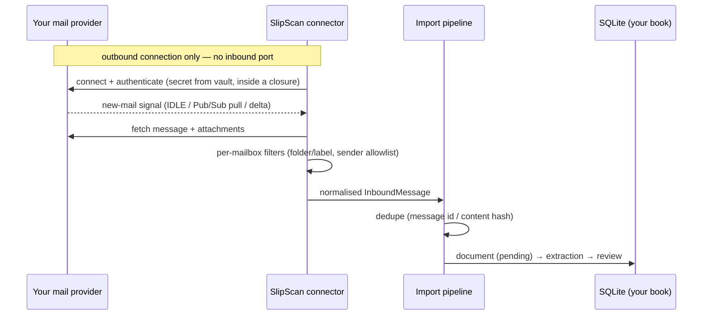

# Email Ingestion

Your inbox is where receipts, statements, and bank alerts already arrive. SlipScan connects to **your own mailbox** and turns that stream into documents — locally, with no mail relay, no forwarding address, and no SlipScan-operated OAuth client or webhook receiver. Adding a provider never requires our infrastructure, because there isn't any.

One `MailboxConnector` trait (in `crates/slipscan-ingest`), four providers.

> **Status — read this first.** The connector code below (IMAP UID sync + IDLE, Gmail history deltas + Pub/Sub pull, Graph deltas + device-code auth, Proton via Bridge) is implemented and tested in `crates/slipscan-ingest`, but the only surface wired to it today is the CLI's **one-shot generic-IMAP poll**: `slipscan mail-sync` fetches unseen messages from a configured IMAP folder and imports attachments as documents, then exits. There is **no long-running push loop** on any surface yet (no IDLE holding, no Pub/Sub polling, no watch renewal), the desktop app's mailbox settings currently cover generic IMAP fields only (no Gmail/Outlook add flow), and `slipscan-server` does not run mailbox connectors at all. Sections describing those flows document the implemented library behaviour and the intended UX; the wiring is tracked in [ROADMAP.md](../ROADMAP.md).

## The connectivity matrix

| Provider | Sync | Push (near-real-time) |
|---|---|---|
| Generic IMAP (any host) | UID-cursor polling | **IMAP IDLE** |
| Gmail | `history.list` deltas (BYO OAuth client, loopback flow) | **watch → Cloud Pub/Sub *pull* subscription** |
| Outlook / Microsoft 365 | Graph delta queries (BYO app registration, device-code flow) | Graph change notifications — self-host server mode only; otherwise delta polling |
| Proton Mail | IMAP via local **Proton Bridge** | IMAP IDLE against the bridge |

Every connector normalises into the same document-import pipeline: attachments and receipt-like bodies become documents, and dedupe applies before anything is stored. (Parsing bank-alert emails — "You spent R 184.50 at…" — into transaction candidates is planned but **not implemented**; today alert emails are only captured as documents if they carry attachments or receipt-like bodies.)

## How push works with no public endpoint

Push normally means webhooks, and webhooks mean a public HTTPS endpoint — which a local-first app doesn't have. SlipScan gets push anyway, without one:

- **IMAP IDLE** is a *held-open connection*: the client connects out to the server and waits; the server announces new mail down that same connection. Nothing ever connects *to* you.
- **Gmail Pub/Sub pull** works the same way at a different layer: Gmail publishes "mailbox changed" events into a Pub/Sub topic **in your own Google Cloud project**, and SlipScan *pulls* from the subscription over an outbound connection. Google never needs to reach your machine.
- **Microsoft Graph** has no pull-style push — its change notifications require a reachable HTTPS endpoint. So on desktop SlipScan uses delta polling (cheap: each poll sends only a delta token), and true push is available only when you run [self-host server mode](SELFHOST.md) and expose an endpoint yourself.

All connections are outbound, from your machine, to your provider. That is the whole trick.

---

## Generic IMAP (any host)

Works with any IMAP server: your own mail server, Fastmail, a [lilmail](https://github.com/vul-os)-managed mailbox, your ISP. This is the one provider you can use end-to-end today, via the CLI:

1. Configure host, port (993/TLS), username, and folder (`slipscan mail-sync` reads its config from settings; see [CONFIGURATION.md](CONFIGURATION.md)).
2. Use an **app password** if your provider supports them; it goes into the [credential vault](THREAT-MODEL.md) and is never displayed again.
3. Run `slipscan mail-sync` (e.g. from cron/launchd) — each run fetches unseen messages and imports their attachments as documents.

**Sync (library):** the connector keeps a per-folder UID cursor and fetches only messages above it. **Push (library, not yet wired):** the connector can hold an IDLE connection and re-issue it when the server drops it (~29 minutes on many servers) — but no shipped surface runs that loop yet; today sync happens only when you run `mail-sync`.

## Gmail — connector implemented, no app surface yet

Gmail's IMAP works today (use the generic-IMAP path above with an app password). The dedicated Gmail connector below (API deltas, labels, Pub/Sub push) exists in `slipscan-ingest` but is **not yet reachable from the CLI or desktop app** — the setup steps are written for when that wiring lands. The trade-off is a one-time setup of **your own** Google Cloud project — SlipScan has no central OAuth client, so you bring yours.

### One-time Google Cloud setup

1. Create a project at https://console.cloud.google.com (any name).
2. Enable the **Gmail API** (and **Pub/Sub API** for push).
3. Create an **OAuth client id** of type **Desktop app**. Note the client id and secret.
4. Add your own Google account as a test user on the OAuth consent screen. (Your client serves only you — no verification process needed.)

### Connect (intended flow — no UI for this yet)

1. Provide the client id + secret (secret → vault).
2. SlipScan starts the **loopback OAuth flow**: your browser opens, you sign in to Google, and Google redirects to `http://127.0.0.1:<port>` where SlipScan is listening. The refresh token goes straight into the vault.
3. Pick a label to watch (e.g. create a Gmail filter that labels receipts `slipscan`).

**Sync:** SlipScan stores a `historyId` cursor and calls `history.list` — each sync transfers only what changed since last time.

### Push via Pub/Sub pull

1. In your project, create a Pub/Sub **topic** (e.g. `slipscan-mail`) and grant `gmail-api-push@system.gserviceaccount.com` the Publisher role on it.
2. Create a **pull subscription** on the topic.
3. In SlipScan, set the topic name on the mailbox. SlipScan issues `users.watch` and then long-polls the pull subscription.

New mail → Gmail publishes to your topic → an outbound pull sees it within seconds → `history.list` fetches the delta. The watch expires every 7 days and must be renewed. No public endpoint, no domain, no TLS certificate — the pull subscription is why. (The pull/watch/renewal code exists in the connector; nothing runs it continuously yet.)

## Outlook / Microsoft 365 — connector implemented, no app surface yet

Uses Microsoft Graph with **your own app registration**. Like Gmail, the connector is implemented in `slipscan-ingest` but not yet reachable from the CLI or desktop app.

### One-time Entra setup

1. https://entra.microsoft.com → **App registrations → New registration**. Single tenant ("Accounts in this organizational directory only") or personal-account type as fits your account.
2. Enable **Allow public client flows** (for device code). No client secret needed.
3. API permissions: delegated `Mail.Read` and `offline_access`.
4. Note the **Application (client) ID** and tenant id.

### Connect (intended flow — no UI for this yet)

1. Provide the client id + tenant.
2. SlipScan shows a **device code**: open https://microsoft.com/devicelogin on any browser, enter the code, sign in. No redirect URI, no local web server — device-code flow is built for apps like this.
3. The refresh token lands in the vault. Pick a folder to watch.

**Sync:** Graph **delta queries** on the watched folder — SlipScan stores the `deltaLink` and each poll returns only changes. Polling every few minutes costs almost nothing.

**Push:** Graph change notifications require a public HTTPS endpoint that Microsoft can call. SlipScan does not open one — delta polling is the answer. (`slipscan-server` does not currently expose a Graph change-notification receiver either; if one is ever added it will be documented in [SELFHOST.md](SELFHOST.md).)

## Proton Mail

Proton's encryption means no direct IMAP — the official **Proton Bridge** app decrypts locally and exposes IMAP on `127.0.0.1`.

1. Install and sign in to [Proton Bridge](https://proton.me/mail/bridge) (requires a paid Proton plan).
2. Bridge shows per-account IMAP settings: `127.0.0.1`, a port, a generated password.
3. Add it in SlipScan as a **generic IMAP** mailbox with those values.

The bridge behaves as a normal IMAP server (IDLE included, once a push loop ships). Traffic between SlipScan and Bridge never leaves your machine; Bridge handles the encrypted sync with Proton. Note the plaintext exists only in the local loop between two processes you run.

## Per-mailbox filters

Every mailbox has:

- **Folder / label** — only this source is watched. Use provider-side rules (Gmail filters, Sieve, Outlook rules) to route receipts into it.
- **Sender allowlist** — optional but recommended: only mail from listed senders/domains (`fnb.co.za`, `takealot.com`, …) is processed.

Filters run before any content is parsed. Mail that doesn't match is never fetched beyond headers, never stored, never sent to an extraction provider. Start with a dedicated label + allowlist; loosen later if you find you're missing receipts.

## What gets ingested

- **Attachments** — PDFs and images become documents in the extraction pipeline.
- **Receipt-like bodies** — HTML receipts (e-commerce order confirmations) are captured and extracted.
- **Bank alert emails** — *planned, not implemented*: parsing "You spent R 184.50 at …" notifications into transaction candidates (deduped against scraper/import data during [reconciliation](BANK-ADAPTERS.md)) does not exist yet; today such mails are ingested only if they match the two cases above.

Everything is deduplicated by message id and content hash — connecting a mailbox with years of history will not double-import what you already have.

---

**Next:** [BANK-ADAPTERS.md](BANK-ADAPTERS.md) — pull transactions straight from your bank with auditable, local scrapers.
