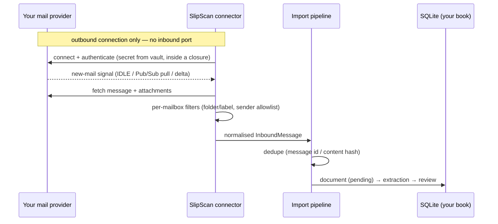

# Email Ingestion

Your inbox is where receipts, statements, and bank alerts already arrive. SlipScan connects to **your own mailbox** and turns that stream into documents — locally, with no mail relay, no forwarding address, and no SlipScan-operated OAuth client or webhook receiver. Adding a provider never requires our infrastructure, because there isn't any.

One `MailboxConnector` trait (in `crates/slipscan-ingest`), four providers.

> **Status — read this first.** The connector code below (IMAP UID sync + IDLE, Gmail history deltas + Pub/Sub pull, Graph deltas + device-code auth, Proton via Bridge) is implemented and tested in `crates/slipscan-ingest`. The surface wired to it is the CLI's **one-shot poll**, now for all three connectors: `slipscan mail-sync --provider {imap,gmail,graph}` (default `imap`, so existing invocations are unchanged) fetches unseen messages from the configured mailbox, imports attachments and receipt-like bodies as documents, and exits; `slipscan mail-sync --provider {gmail,graph} --login` runs the OAuth grant — loopback + PKCE for Gmail, device code for Graph — and the tokens land in the credential vault. **Bank-alert emails now become transactions** when you pass `--alerts --account <account>` and the book has a `mailrules` pack installed ([below](#bank-alert-emails--transactions)); without both, a sync imports documents only, exactly as before. What is still **not** wired: there is no long-running push loop on any surface (`mail-sync` never calls `wait_for_new`, so no IDLE holding, no Pub/Sub pull, and no `users.watch` renewal), the desktop app's mailbox settings cover generic IMAP fields only (no Gmail/Outlook add flow, and no alert-parsing UI), and `slipscan-server` does not run mailbox connectors at all. Sections describing those flows document the implemented library behaviour and the intended UX; the wiring is tracked in [ROADMAP.md](../ROADMAP.md).

## The connectivity matrix

| Provider | Sync | Push (near-real-time) |
|---|---|---|
| Generic IMAP (any host) | UID-cursor polling | **IMAP IDLE** |
| Gmail | `history.list` deltas (BYO OAuth client, loopback flow) | **watch → Cloud Pub/Sub *pull* subscription** |
| Outlook / Microsoft 365 | Graph delta queries (BYO app registration, device-code flow) | Graph change notifications — self-host server mode only; otherwise delta polling |
| Proton Mail | IMAP via local **Proton Bridge** | IMAP IDLE against the bridge |

**Read the Push column as "the connector can do this", not "SlipScan does this".** No shipped surface runs a push loop: every provider's sync is one poll per `slipscan mail-sync`, and the IDLE / Pub/Sub machinery below is implemented in the library with no caller. Graph push is additionally unsupported by design outside self-host mode.

Mail carries two different things, and they take two different paths:

- a **document** — a PDF/image attachment, or an HTML body that reads like a receipt — goes into the extraction pipeline;
- a **bank alert** — "You spent R 184.50 at…" — becomes a **transaction**, through the same import path a CSV statement uses.

A message can produce both, either, or neither, and dedupe applies on both paths before anything is stored.

## How push works with no public endpoint

Push normally means webhooks, and webhooks mean a public HTTPS endpoint — which a local-first app doesn't have. SlipScan gets push anyway, without one:

- **IMAP IDLE** is a *held-open connection*: the client connects out to the server and waits; the server announces new mail down that same connection. Nothing ever connects *to* you.
- **Gmail Pub/Sub pull** works the same way at a different layer: Gmail publishes "mailbox changed" events into a Pub/Sub topic **in your own Google Cloud project**, and SlipScan *pulls* from the subscription over an outbound connection. Google never needs to reach your machine.
- **Microsoft Graph** has no pull-style push — its change notifications require a reachable HTTPS endpoint. So on desktop SlipScan uses delta polling (cheap: each poll sends only a delta token), and true push is available only when you run [self-host server mode](SELFHOST.md) and expose an endpoint yourself.

All connections are outbound, from your machine, to your provider. That is the whole trick.


```mermaid
sequenceDiagram
    participant M as Your mail provider
    participant C as SlipScan connector
    participant P as Import pipeline
    participant DB as SQLite (your book)

    Note over M,C: outbound connection only — no inbound port
    C->>M: connect + authenticate (secret from vault, inside a closure)
    M-->>C: new-mail signal (IDLE / Pub/Sub pull / delta)
    C->>M: fetch message + attachments
    C->>C: per-mailbox filters (folder/label, sender allowlist)
    C->>P: normalised InboundMessage
    P->>P: dedupe (message id / content hash)
    P->>DB: document (pending) → extraction → review
```

---

## Generic IMAP (any host)

Works with any IMAP server: your own mail server, Fastmail, a [lilmail](https://github.com/vul-os)-managed mailbox, your ISP. The simplest path — no app registration, no OAuth — and the CLI's default provider. The one-time configuration step still needs the server API (the CLI has no settings command yet):

1. Configure host, port (993/TLS), username, and folder: `slipscan mail-sync` reads the `mail.imap.config` setting, which today is written through the server API's `settings_set` (see [CONFIGURATION.md](CONFIGURATION.md#the-settings-model)).
2. Use an **app password** if your provider supports them; it goes into the [credential vault](THREAT-MODEL.md) and is never displayed again.
3. Run `slipscan mail-sync` (e.g. from cron/launchd) — each run fetches unseen messages and imports their attachments as documents. `--provider imap` is the default; passing it explicitly changes nothing.

**Sync (library):** the connector keeps a per-folder UID cursor and fetches only messages above it. **Push (library, not yet wired):** the connector can hold an IDLE connection and re-issue it when the server drops it (~29 minutes on many servers) — but no shipped surface runs that loop yet; today sync happens only when you run `mail-sync`.

## Gmail

Gmail's IMAP also works (use the generic-IMAP path above with an app password). The dedicated Gmail connector below — API deltas, labels — is reachable from the CLI as `slipscan mail-sync --provider gmail`; the desktop app has no Gmail add flow yet, and the Pub/Sub push half is still library-only (see below). The trade-off is a one-time setup of **your own** Google Cloud project — SlipScan has no central OAuth client, so you bring yours.

### One-time Google Cloud setup

1. Create a project at https://console.cloud.google.com (any name).
2. Enable the **Gmail API** (and **Pub/Sub API** for push).
3. Create an **OAuth client id** of type **Desktop app**. Note the client id and secret.
4. Add your own Google account as a test user on the OAuth consent screen. (Your client serves only you — no verification process needed.)

### Connect (CLI; no desktop UI for this yet)

1. Store the client secret in the vault: `slipscan vault set gmail.client_secret` (no-echo prompt; never argv, never displayed again).
2. Write the mailbox config under the `mail.gmail.config` setting — like `mail.imap.config`, through the server API's `settings_set` for now. Fields: `client_id`, `client_secret_ref` (the vault entry name from step 1), `token_ref` (where the tokens will live), `label_id`, and the optional `pubsub_topic` / `pubsub_subscription`. No secret material ever goes in this JSON, only entry names.
3. Run `slipscan mail-sync --provider gmail --login`. SlipScan prints the **loopback OAuth** URL, you open it and sign in to Google, and Google redirects to `http://127.0.0.1:<port>` where SlipScan is listening (PKCE, random state). The refresh token goes straight into the vault under `token_ref`; no token material is ever printed.
4. Pick a label to watch (e.g. create a Gmail filter that labels receipts `slipscan`) and put its id in `label_id`.
5. Sync with `slipscan mail-sync --provider gmail` (cron/launchd, same as IMAP).

**Sync:** SlipScan stores a `historyId` cursor and calls `history.list` — each sync transfers only what changed since last time. The very first run adopts the mailbox's current `historyId` as its baseline and imports nothing; mail from before the connection is a job for file import. Access tokens are refreshed automatically and the rotated set is written back to the vault.

### Push via Pub/Sub pull

1. In your project, create a Pub/Sub **topic** (e.g. `slipscan-mail`) and grant `gmail-api-push@system.gserviceaccount.com` the Publisher role on it.
2. Create a **pull subscription** on the topic.
3. In SlipScan, set the topic name on the mailbox. SlipScan issues `users.watch` and then long-polls the pull subscription.

New mail → Gmail publishes to your topic → an outbound pull sees it within seconds → `history.list` fetches the delta. The watch expires every 7 days and must be renewed. No public endpoint, no domain, no TLS certificate — the pull subscription is why. (The pull/watch/renewal code exists in the connector and is exercised by its tests, but **no shipped surface runs it**: `mail-sync` is a one-shot poll and never calls `wait_for_new`, so configuring `pubsub_topic`/`pubsub_subscription` today only widens the OAuth scopes it asks for.)

## Outlook / Microsoft 365

Uses Microsoft Graph with **your own app registration**. Like Gmail, the connector is reachable from the CLI (`slipscan mail-sync --provider graph`) and has no desktop UI yet.

### One-time Entra setup

1. https://entra.microsoft.com → **App registrations → New registration**. Single tenant ("Accounts in this organizational directory only") or personal-account type as fits your account.
2. Enable **Allow public client flows** (for device code). No client secret needed.
3. API permissions: delegated `Mail.Read` and `offline_access`.
4. Note the **Application (client) ID** and tenant id.

### Connect (CLI; no desktop UI for this yet)

1. Write the mailbox config under the `mail.graph.config` setting (server API `settings_set`, as above). Fields: `client_id`, `tenant`, `folder` (a well-known name like `inbox`, or a folder id), and `token_ref`. A public client has no secret, so this JSON is the whole configuration.
2. Run `slipscan mail-sync --provider graph --login`. SlipScan shows a **device code**: open https://microsoft.com/devicelogin on any browser, enter the code, sign in. No redirect URI, no local web server — device-code flow is built for apps like this.
3. The refresh token lands in the vault under `token_ref`, and is never displayed.
4. Sync with `slipscan mail-sync --provider graph`.

**Sync:** Graph **delta queries** on the watched folder — SlipScan stores the `deltaLink` and each poll returns only changes. Polling every few minutes costs almost nothing. An expired delta token (HTTP 410) triggers one full resync; document dedup absorbs the refetch.

**Push:** Graph change notifications require a public HTTPS endpoint that Microsoft can call. SlipScan does not open one — delta polling is the answer. (`slipscan-server` does not currently expose a Graph change-notification receiver either; if one is ever added it will be documented in [SELFHOST.md](SELFHOST.md).)

## Proton Mail

Proton's encryption means no direct IMAP — the official **Proton Bridge** app decrypts locally and exposes IMAP on `127.0.0.1`.

1. Install and sign in to [Proton Bridge](https://proton.me/mail/bridge) (requires a paid Proton plan).
2. Bridge shows per-account IMAP settings: `127.0.0.1`, a port, a generated password.
3. Add it in SlipScan as a **generic IMAP** mailbox with those values.

The bridge behaves as a normal IMAP server (IDLE included, once a push loop ships). Traffic between SlipScan and Bridge never leaves your machine; Bridge handles the encrypted sync with Proton. Note the plaintext exists only in the local loop between two processes you run.

## Per-mailbox filters

Every mailbox has:

- **Folder / label** — only this source is watched (`folder` for IMAP/Graph, `label_id` for Gmail). Use provider-side rules (Gmail filters, Sieve, Outlook rules) to route receipts into it.
- **Sender allowlist** — optional but recommended: only mail from listed senders/domains (`fnb.co.za`, `takealot.com`, …) is processed. Implemented and tested in the library (`MailboxFilter`, addresses/domains/subdomains), but **no surface configures it yet**: `slipscan mail-sync` runs with an empty allowlist, which means allow-all, so today the folder/label is what narrows the stream.

The folder/label filter is provider-side: mail outside it is never fetched. The sender allowlist runs on the fetched message before anything is imported — non-matching mail is never stored and never sent to an extraction provider. Start with a dedicated label; add an allowlist once it is configurable, and loosen later if you find you're missing receipts.

## Bank alert emails → transactions

Your bank emailing you that a card was used is the most common way money visibly moves. SlipScan turns those messages into transactions — and it does it **without a single bank's format in the product**.

### Formats are packs, not code

Every bank writes its alerts differently, and the differences are per-bank *and* per-country: currency position, decimal comma vs point, day-first vs month-first dates, month names in the local language. Baking any of that into SlipScan would put jurisdiction literals in core logic, which the [architecture contract](ARCHITECTURE.md#global-by-default--regions-are-data-not-code) forbids.

So alert formats are a **pack kind**, alongside `taxonomy` and `benchmark`: `mailrules`. They get the whole existing pack pipeline for free — ed25519 signatures, TOFU signer pinning per pack id, strict semver upgrades, per-book installation, the audit log. See [PACKS.md](PACKS.md#mailrules-packs) for the format.

**SlipScan ships no bank patterns at all.** There is no builtin `mailrules` pack, and there is no default; until you install one, `--alerts` has nothing to match and says so. Community packs for FNB, Capitec, Chase, Revolut and the rest are data somebody publishes and you choose to trust — exactly like a taxonomy pack.

### Turning it on

```bash
# 1. Install a mailrules pack you trust (signed, like any pack).
slipscan pack install ./my-bank-alerts.json \
    --signature @my-bank-alerts.sig --public-key @publisher.key

# 2. Sync, and book matched alerts to an account.
slipscan mail-sync --alerts --account "Cheque"
```

`--alerts` requires `--account`: an alert becomes a transaction, and there is no sensible account to guess. Without `--alerts` nothing changes — a sync imports documents only, as it always did.

### What it does with a match

A matched message is parsed into a **statement line** and fed through `import_statement_lines` — *the same function CSV and scraper statement imports call*. That is deliberate, and it is where most of the value comes from:

- **dedupe** — by the bank's reference when the pack declares one as unique, otherwise by content hash, so refetching a mailbox is safe;
- **categorisation** — the transaction carries a description and no invented merchant, so core derives the matching key from the narrative and runs the normal cascade: your own corrections and learned mappings first, installed pack rules only for a merchant your book has no opinion about;
- **payment detection** — the [Payments](PAYMENTS.md) hook lives inside `transaction_create`, so an emailed "payment received, reference INV-2026-114" now fires it. `slipscan mail-sync` already flushes due webhook deliveries in the same command, which makes *email in → webhook out* a single invocation.

Transactions from mail carry `source = email`, so they stay distinguishable from CSV and scraper imports in reports and [reconciliation](BANK-ADAPTERS.md).

### It declines rather than guesses

A wrongly-parsed transaction is far worse than an unparsed one: it corrupts the books, and because categorisation writes a durable merchant mapping on the way through, it teaches the learning loop to keep being wrong. So a rule that matches but cannot read a field cleanly **declines, and says why**:

- the captured amount must be digits and separators only — any letter means the pattern swept up prose, and `12 Jul 2026` must never be scanned into `122026`;
- the decimal separator must be the one the rule declared, so a point-locale rule meeting `1 234,56` declines instead of booking 123 456;
- amounts are decimal → **`i64` minor units**, never floats, and must be strictly positive — direction comes from the rule, never from a stray minus sign;
- a date pulled out of the text must use **named** `y`/`m`/`d` capture groups (so `03/04` cannot be silently reinterpreted) and must land within a configurable window of the message's own date;
- a two-way debit/credit test must match exactly one side; both or neither is a decline;
- an account hint that contradicts the target account declines, rather than putting one card's spend on another's ledger.

Declines that are worth acting on — a rule recognised the mail and then failed on a field — are printed by `mail-sync` and included in its `--json` output. Mail no rule claims, and mail a rule's gates stood down on (your bank's statements and marketing come from the same domain as its alerts), are not reported: that is the gating working, and reporting it would bury the real signal.

### What is still missing

- No desktop UI: alert parsing is CLI-only today. There is no screen for installing a `mailrules` pack, choosing the target account, or reviewing declines.
- No multi-account routing on the CLI: `--account` books everything from one sync to one account. The account hint is extracted and is used to *reject* a mismatch, and the library has the grouping function multi-card routing needs (`group_by_account_hint`), but no surface calls it yet.
- Alerts are not automatically reconciled against the same transaction arriving later in a CSV or scraper import; that is ordinary [reconciliation](BANK-ADAPTERS.md) work.
- Two genuinely identical alerts in one mailbox (same date, amount, currency and merchant) with no bank reference are indistinguishable from one alert fetched twice, and the second is counted as a duplicate rather than imported. A pack whose bank sends a unique reference is unaffected.

## What gets ingested

- **Attachments** — PDFs and images become documents in the extraction pipeline.
- **Receipt-like bodies** — HTML receipts (e-commerce order confirmations) are captured and extracted.
- **Bank alert emails** — become transactions when a `mailrules` pack matches them and `--alerts --account` is passed (see above). A bank alert is deliberately *not* a receipt: it does not become a document unless it also carries an attachment.

Everything is deduplicated by message id and content hash — connecting a mailbox with years of history will not double-import what you already have.

---

**Next:** [BANK-ADAPTERS.md](BANK-ADAPTERS.md) — pull transactions straight from your bank with auditable, local scrapers.
