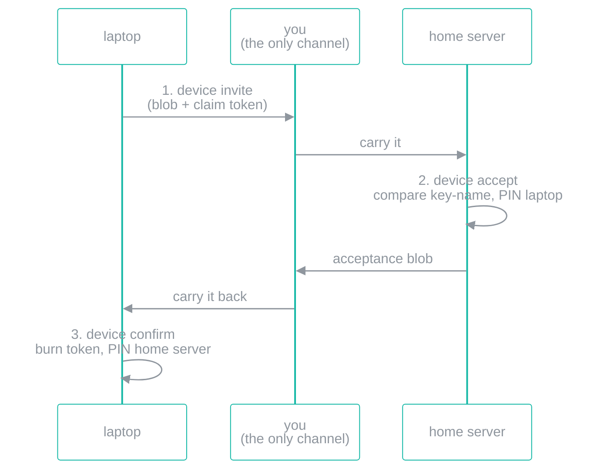

# Nodes — device identity and pairing

> **Nothing syncs yet.** This document describes **phase 1 of the node model: identity only.** Two SlipScan devices can now generate keys, learn each other's keys, and refuse impostors. There is no oplog, no transport, no replication loop, and no code path anywhere in the tree that ships a change from one device to another. If you pair two devices today, nothing happens afterwards. The [gap list](#what-is-still-missing) at the bottom is the honest accounting of what would have to exist before that sentence changes.

## No accounts. Not "optional accounts" — none.

There is no email address, no password, no username, no login screen, no password reset, and no server that decides who you are. There is no SlipScan account because there is no SlipScan.

A device generates an **ed25519 keypair on itself**, at first run, and:

- the **public key *is* the device id** — there is no other identifier, and nothing maps a name to it;
- the **private half goes straight into the write-only credential vault** ([THREAT-MODEL.md](THREAT-MODEL.md#the-credential-vault)) and has no read path at all. It can be created, rotated, revoked and *used*; it can never be viewed or exported, by you or by anything else.

Nothing is provisioned, escrowed, or shipped in the binary, so there is no factory secret for a supply-chain attacker to copy.

```
slipscan device init --label "laptop"
```

```
This device is laptop
  device id  d27b99479c30385d8b786544a280c310e07356095bdf38d88aabf3bf9e79f2cf
  key-name   suba-gome-gina-delu-vosu-vazo-poti-kofi-zidu
```

## Fingerprints are words, because hex does not get compared

That second line is the **key-name**: eight words carrying 80 bits of a BLAKE3 digest of the public key, plus a **checksum word**. It comes from `kotva-core`, the same encoding Kotva identities use — not invented here, so a user who has compared one has compared both.

It exists because a fingerprint nobody compares protects nobody. Nobody reads 64 hex characters down a phone line; they check the first four and the last four and say "yep". Nine short pronounceable words get read out in full, and the checksum word means a misheard or mistyped one **fails closed** — you are told you typed it wrong, rather than being sent to some other key.

```
slipscan device fingerprint
```

## The shapes a node comes in

**Same binary, every time.** A node is just a machine running SlipScan. The shape is a deployment choice, not a role in a protocol, and **none of them is load-bearing**:

| Shape | What it is | What it is *not* |
|---|---|---|
| **Laptop / desktop** | The Tauri app, or the CLI. Usually the machine you actually work on. | Not "the primary". Nothing elects one. |
| **Home server / NAS** | `slipscan serve` on a box that stays on ([SELFHOST.md](SELFHOST.md)). Convenient because it is awake when your laptop is shut. | Not a hub, not a coordinator, not a source of truth. |
| **Rented cloud box** | The same `slipscan serve`, on hardware you rent instead of own. | Not *our* infrastructure. There is no SlipScan-operated anything, and renting a VPS does not create one. |

There is **no coordinator, no directory, no rendezvous service, and no default endpoint** — not disabled by default, *absent*. The pack subsystem makes the same structural promise ([ARCHITECTURE.md](ARCHITECTURE.md#classification-packs--one-install-pipeline)) and for the same reason: a default endpoint is a centralisation you can only opt out of, whereas a missing one is a centralisation that cannot happen. Nothing in a pairing blob carries a hostname, a port or a URL, and a test asserts it.

## Pairing, without accounts and without a network

Pairing is a **local, human-in-the-loop ceremony**. SlipScan opens no socket to perform it. The two blobs are base64url text and moving them between devices is your job — a QR code, a paste into a chat, a file on a USB stick.



```
# on the laptop
slipscan device invite --label "home server"

# on the home server — the key-name is read off the laptop's screen
slipscan device accept ss-pair1.… --expect-keyname suba-gome-gina-delu-vosu-vazo-poti-kofi-zidu

# back on the laptop, with the home server's key-name
slipscan device confirm ss-pair1.… --expect-keyname pusu-sila-lozo-rabo-nefe-bire-zola-keze-tilu
```

The invite carries a **256-bit claim token**, stored **hashed**, **single-use** (burned on redemption) and **short-lived** (10 minutes by default). Replaying an acceptance is refused; so is one addressed to a different device.

## What pairing proves — and what it does not

This is the part worth reading twice, because the honest answer is narrower than "the devices are now trusted".

**It proves:**

- the other side **holds the private key** matching the public key in the blob (every blob is signed);
- the blob was **not modified in flight** — a tampered one fails its signature;
- the acceptance answers **this** invite (the claim token) and is addressed to **this** device;
- after this moment, **that exact key is pinned here**, and a different key is a refusal.

**It does not prove:**

- **who the other side is** — the blobs are *self-signed*. An attacker who replaces the whole blob, key and all, produces one that verifies perfectly. What actually authenticates a pairing is **you comparing the key-name against the other device's screen**. `--expect-keyname` makes that comparison enforceable; `--unverified` skips it and pins whatever showed up, which is why the CLI refuses to run without one of the two spelled out.
- **that the key belongs to a person.** Identity here is a key, not a human. SlipScan has no idea who owns anything.
- **anything about authorisation.** A pinned peer is not permitted to do anything, because there is nothing to do — see below.
- **that either device is uncompromised.** Malware in your session can invoke the vault exactly as SlipScan does ([THREAT-MODEL.md](THREAT-MODEL.md#residual-risks--stated-plainly)).

This is trust-on-first-use, taken literally and no further. It is the same discipline `slipscan-packs` already applies to pack signers, and it is copied from AQL's [`proto/PAIRING-PROFILE.md`](https://github.com/vul-os/aql) rather than invented.

## A key change is a refusal, never a silent re-pin

The rule the whole design exists to make true in code:

> A peer's key is accepted at exactly one moment — the redeem — and thereafter only a **deliberate local reset** can change it.

What that means concretely:

- **The local identity is written once.** A second `device init` is refused. Replacing it is `device rotate` (which must be **signed by the key it replaces**, proving possession) or `device reset` (a deliberate local wipe). Rotating with a vault key that does not match the pinned public key is refused.
- **Revocation leaves a tombstone.** `device revoke` does not delete the pin — it marks it. A revoked device that runs the ceremony again is **refused**, so a device you threw out cannot let itself back in. The only way back is `device forget`, run by you, locally.
- **A rotated peer is a new peer.** Because the key *is* the id, a peer that rotates arrives as a new device id and pairs as a new peer. The old pin is left exactly as it was. Nothing anywhere upgrades an existing pin to a new key.
- **An unusable pinned key refuses instead of panicking.** A truncated or hand-edited row reaches the ed25519 primitive directly, having never passed a length-checking decoder. It is refused. (Most ed25519 libraries panic on a wrong-sized key; a books daemon must decline a command it cannot verify, not die on it.)
- **The set of writers is asserted, not just the behaviour.** Every behavioural test above keeps passing if someone later adds a *new call site* that writes a peer key outside the trust-on-first-use branch — a config reload, a recovery path, an import. So a structural test counts the code paths that write a pinned key and fails if the set changes.

## What crosses HTTP, and what stays local

`slipscan-server` terminates no TLS and can be bound to a LAN, so the split follows the same rule the credential vault and webhook endpoints already follow: **anything that would put key material or a claim token on the wire is local-only.**

| Served (`/api/v1/…`) | Local-only (CLI / desktop) |
|---|---|
| `device_status`, `device_list`, `device_get` | `device_init`, `device_rotate`, `device_reset` |
| `device_invite_list` (never a token), `device_rotations` | `device_forget` |
| `device_revoke` | `device_pair_invite`, `device_pair_accept`, `device_pair_confirm` |

Revoking is served on purpose: cutting a lost device off a headless box should not require physical access to that box. **Un-revoking is not**, because `forget` is the reset that lets a revoked key back in — if HTTP could reach it, the pin would be exactly as strong as the bearer token.

The pairing ceremony is local for two independent reasons, either sufficient: invites carry a single-use claim token, and the step that actually authenticates a pairing is a human comparing a key-name against another screen. There is no human on the far end of a POST. On a headless box you run the CLI over ssh — which is where the human is anyway.

The local-only routes are registered and answer **403 with the local command to run**, rather than 404 — an absent route reads like an oversight, a refusal reads like a decision.

## What is still missing

Everything that would make the word "sync" apply. In rough dependency order:

1. **An oplog.** SlipScan has no per-device operation log — no monotonic counter, no causal metadata, nothing that records "this device made this change" in a form another device could replay. Today's `audit_log` is a local human-readable trail, not a replication source.
2. **A transport.** Nothing opens a connection to a peer. There is no protocol, no framing, no session, no handshake beyond the paired keys sitting in a table. Deciding this is genuinely open: it may be DMTAP/Kotva, it may be something plainer.
3. **Reachability.** Two paired devices still have to *find* each other, which is the hard part of a design with no coordinator and no directory. A broker is possible (Ephor is the candidate named in the README) but nothing is built and nothing is committed to.
4. **Authorisation.** A pinned peer currently means "I know this key". It does not say which books it may read, which it may write, or how a device is scoped to a subset. That model does not exist yet.
5. **Conflict handling in practice.** The merge algebra exists — `crates/slipscan-sync` maps SlipScan's state into the shared DMTAP Sync algebra ([ARCHITECTURE.md](ARCHITECTURE.md#sync--an-algebra-mapping-only-nothing-syncs-between-devices)) — but it is a mapping and nothing else. It has never been driven by real ops from a real peer.
6. **Recovery.** What happens when a device is lost, when the vault is gone, or when the last device holding a book dies. There is no answer yet; do not build a workflow that assumes one.

Until at least 1–3 exist, **pairing two devices changes nothing about your data.** Sharing a book still means what [Data location](ARCHITECTURE.md#data-location--backup--your-folder-your-cloud-your-responsibility) and [Household members](ARCHITECTURE.md#household-members--per-person-attribution) say it means: a synced data folder, or the self-host server with other surfaces as clients.

## Command reference

| Command | Does |
|---|---|
| `device init [--label]` | Generate this device's keypair. Refused if one exists. |
| `device show` | This device's id and key-name. |
| `device fingerprint [<device-id>]` | Key-name of a device id, or of this device. |
| `device list` | Paired devices, tombstones included. |
| `device invite [--label] [--ttl]` | Mint a single-use invite blob. |
| `device accept <blob> --expect-keyname <words>` | Pin the inviter; emit the acceptance blob. |
| `device confirm <blob> --expect-keyname <words>` | Burn the token; pin the accepter. |
| `device invites` / `device cancel-invite <id>` | Invite metadata (never a token) / withdraw one. |
| `device revoke <device-id>` | Tombstone a peer. It cannot re-pair itself. |
| `device forget <device-id>` | Drop the pin entirely — the deliberate local reset. |
| `device rotate` / `device rotations` | Rotate this device's key, signed by the outgoing one / show the chain. |
| `device reset --yes` | Destroy this device's key and identity. Peer pins are kept. |

`--json` works on all of them. `accept` and `confirm` require either `--expect-keyname` or an explicit `--unverified`.

---

**Next:** [THREAT-MODEL.md](THREAT-MODEL.md) — what an attacker with your files actually gets.
