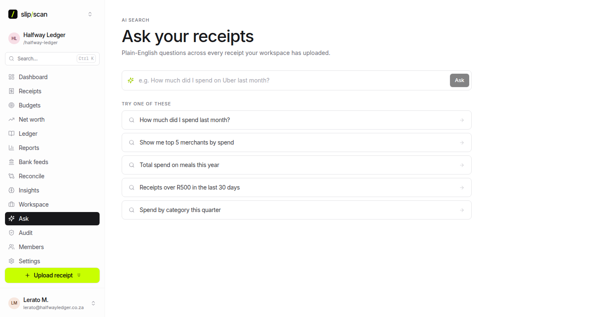

# Screenshots

A visual tour of SlipScan. Electric-lime accent on ink neutrals, Inter for UI, Geist Mono for anything with digits. Dark theme is first-class.

> These captures show the current design direction. Automated regeneration via `scripts/screenshots.mjs` (Playwright against a seeded demo book, per the VulOS screenshotter standard) lands with the new Tauri UI — until then, the gallery is updated by hand.

---

## Dashboard

The home view: balances across accounts, spend vs budget for the month, category breakdown, and recent activity — all computed locally from your book.

---

## Receipts

Every captured slip — dropped, watched, or ingested from your mailbox — with its extraction status at a glance (`pending → extracted → reviewed`).

---

## Receipt detail

One slip, fully extracted: line items, per-line categories, discounts, and VAT, side-by-side with the original image. Corrections here stay local and train your classifier.

---

## Reconcile

Suggested matches between bank transactions, receipts, and journal lines. Confirm with one click; every confirmation is auditable.

---

## Ledger

The accounting side: chart of accounts, balanced journals, VAT — Xero-class books that never leave your machine.

---

## Ask

Ask questions about your own data in plain language, answered by the LLM provider *you* configured — BYO key or fully local via Ollama/llmux.

---

**Next:** [FAQ.md](FAQ.md) — the questions everyone asks, answered straight.
