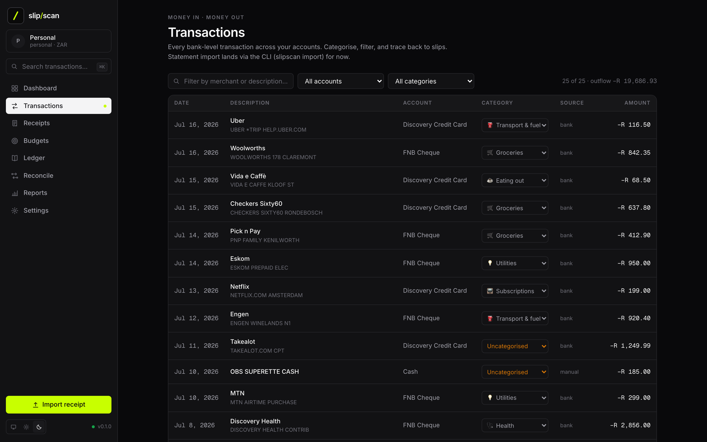
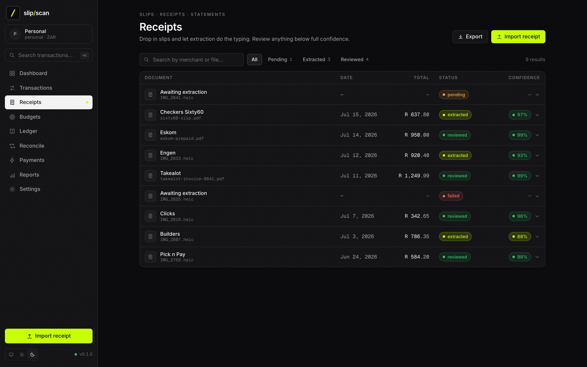
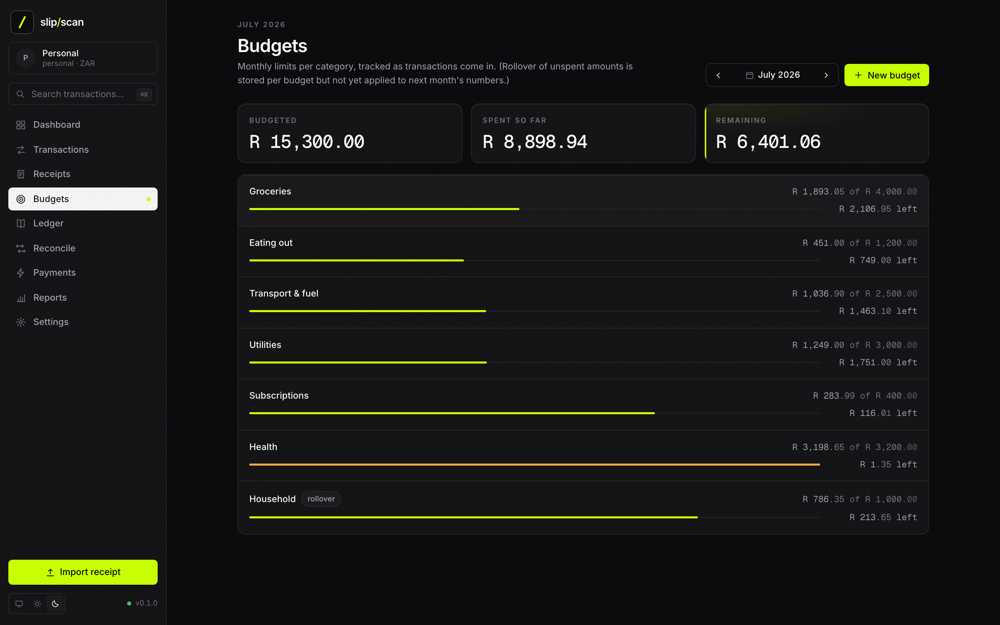
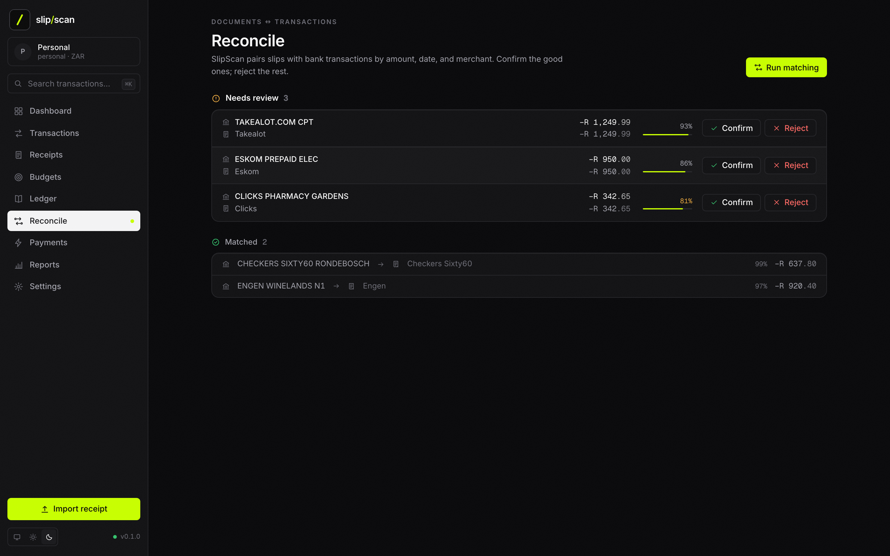
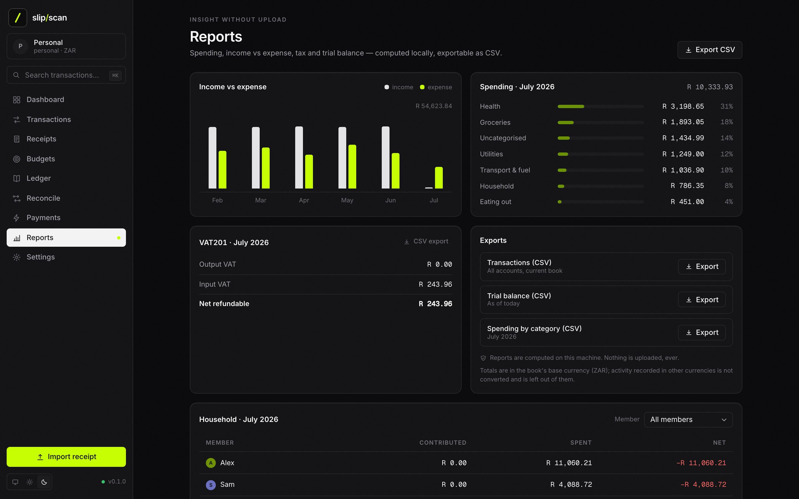
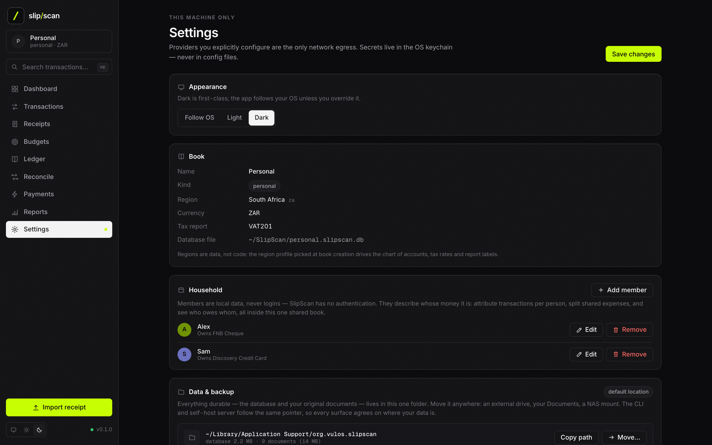
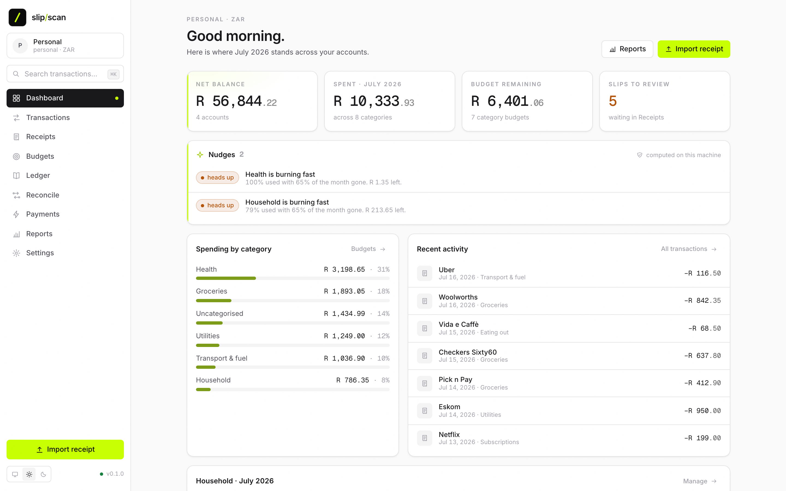

# Screenshots

Every screen of the shipped desktop app — dark theme first, plus light mode at the end. All shots show a **seeded demo book** (a South African personal book in ZAR: FNB/TymeBank/Discovery accounts, Checkers and Pick n Pay slips); none of it is real data, and none of it ever left the machine that rendered it.

**Contributors:** the gallery is regenerated automatically against the demo book — run `npm run screenshot` from `apps/desktop` and commit the refreshed PNGs (they live in `assets/screens/` and are mirrored here in `docs/screenshots/`).

---

## Dashboard

The home view: net balance across accounts, spend for the month, budget remaining, and slips waiting for review — with locally-computed nudges ("Subscriptions is burning fast") and recent activity below. The "computed on this machine" tag is literal: the nudge engine never phones anywhere.

---

## Transactions

Every bank-level transaction across accounts, filterable by account and category, with inline category dropdowns. The source column shows where each row came from (`bank` import or `manual` entry). Statement import lands via the CLI (`slipscan import`) for now.

---

## Receipts

Every captured slip with its extraction status — `pending → extracted → reviewed`, with `failed` surfaced honestly — plus date, total, and extraction confidence. Searchable by merchant or filename, filterable by status.

---

## Receipt detail

Expanding a slip shows the extracted line items inline: quantities, per-line prices, VAT, and discounts, with the extraction confidence up top. Corrections stay local and train your classifier.

---

## Budgets

Per-category monthly limits with burn bars, amounts remaining, and month-to-month navigation. A rollover flag is stored per budget (the `rollover` chip) but not yet applied to next month's numbers — the screen says so itself.

---

## Ledger

The double-entry side: chart of accounts grouped by type (assets, liabilities, equity, income, expenses) with per-account VAT treatment from the region profile, plus Journal and Trial balance tabs. Books that never leave your machine.

---

## Reconcile

SlipScan scores matches between bank transactions and slips by amount, date, and merchant. High-confidence pairs land in **Matched**; anything ambiguous goes to **Needs review** for a one-click confirm or reject.

---

## Reports

Income vs expense by month, spending by category, the tax summary your region profile names (VAT201 here), and CSV exports — transactions, trial balance, spending. All computed locally; the footer note is the contract: nothing is uploaded, ever.

---

## Settings

Appearance, book facts (region, currency, tax report, the SQLite file's path on disk), opt-in OpenRate FX, and LLM extraction provider — `None — manual entry only` is the default. Providers you explicitly configure are the only network egress; secrets live in the OS keychain.

---

## Light mode

The same Dashboard in the light theme. The app follows your OS by default; override it per-book in Settings or with the toggle in the sidebar footer.

---

**Next:** [FAQ.md](FAQ.md) — the questions everyone asks, answered straight.
