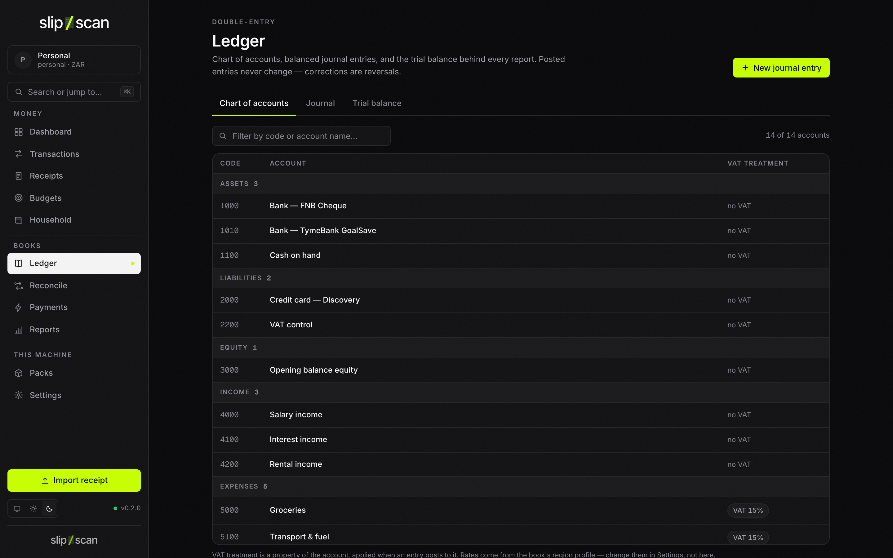
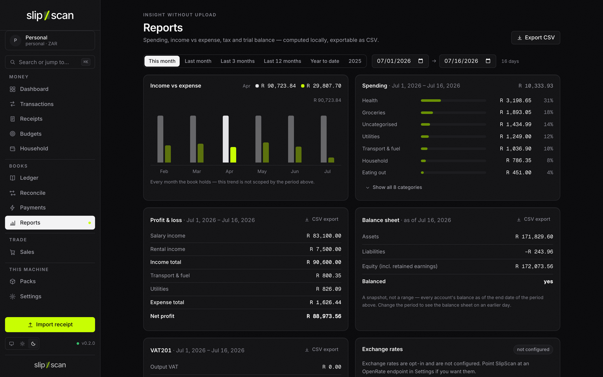
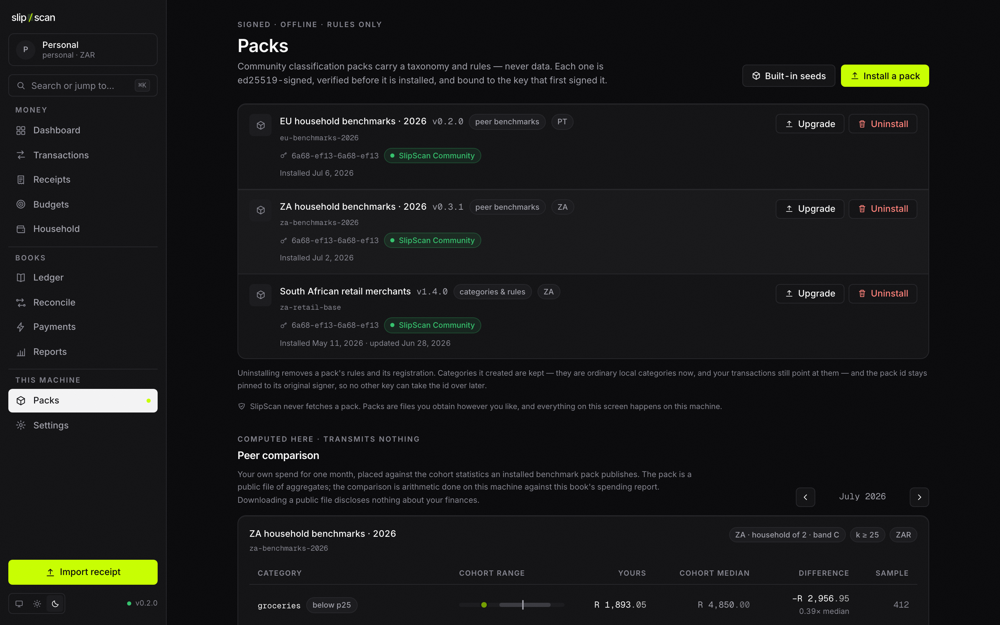
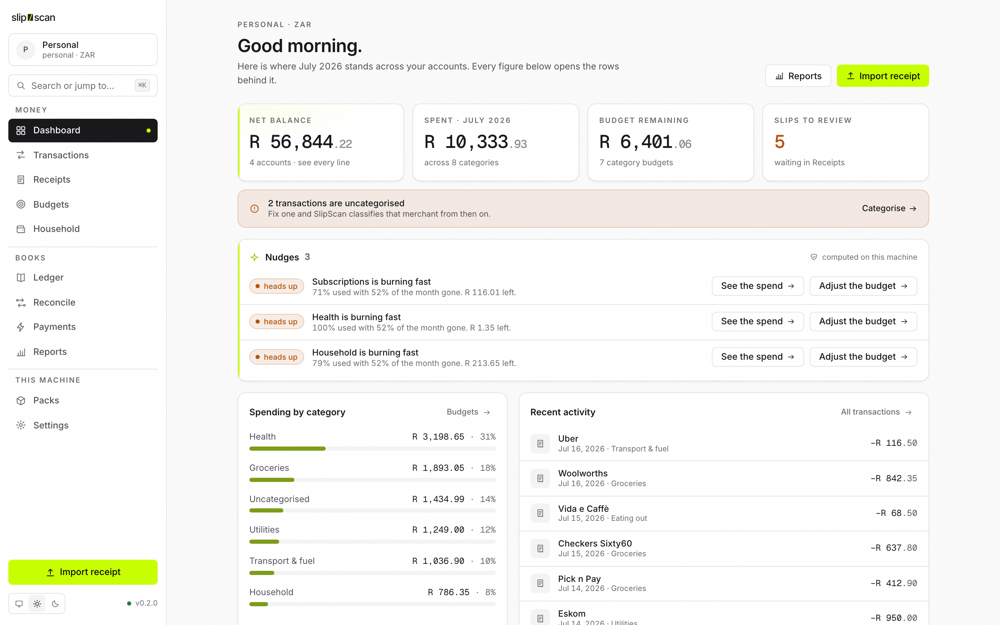

# Screenshots

Every screen of the shipped desktop app, in sidebar order — dark theme throughout, plus light mode at the end. All shots show a **seeded demo book** (a South African personal book in ZAR: FNB/TymeBank/Discovery accounts, Checkers and Pick n Pay slips, two household members called Alex and Sam); none of it is real data, and none of it ever left the machine that rendered it.

Twelve screens are captured, thirteen images: the eleven routes, the expanded receipt detail, and the Dashboard again in light. (`hero.png` is a byte-identical copy of `dashboard.png` kept for outside embedders; it is not a separate shot.)

**Contributors:** the gallery is regenerated automatically against the demo book — run `npm run screenshot` from `apps/desktop`, which captures into `docs/screenshots/` and then mirrors into `assets/screens/` and `site/screenshots/`. Commit all three; `npm run screenshots:check` fails if they drift apart. The route list is read straight out of `src/lib/router.svelte.ts`, so a new screen joins the gallery as soon as it is routable — there is no list here to keep in step. The capture pins its clock, locale and timezone, so re-running it on an unchanged UI reproduces the same bytes.

Alongside it, `npm run qa:shots` sweeps every route at 760/1100/1520px in both themes and grabs the focus ring — the two things this gallery cannot show, since it is one width in one theme. That sweep is for reading before a UI change lands, not for committing: it writes to a temp directory (override with `QA_OUT`).

---

## Dashboard

The home view: net balance across accounts, spend for the month, budget remaining, and slips waiting for review — with locally-computed nudges ("Subscriptions is burning fast") and recent activity below. The "computed on this machine" tag is literal: the nudge engine never phones anywhere. Every stat card opens the rows behind it.

---

## Transactions

Every bank-level transaction across accounts, filterable by account, category and date, with inline category dropdowns and a **Member** column carrying per-person attribution. Rows are selectable for bulk edits, and a filter set can be kept with **Save view**. Statement import lands via the CLI (`slipscan import`) for now — the screen says so in its own subheading rather than implying a drag-and-drop that does not exist.

---

## Receipts

Every captured slip with its extraction status — `pending → extracted → reviewed`, with `failed` surfaced honestly — plus date, total, whether it is matched to a transaction, and extraction confidence. Searchable by merchant or filename, filterable by status, and fully keyboard-driven (`J`/`K` move, `↵` opens, `Esc` closes).

---

## Receipt detail

Expanding a slip shows what reconciling it against the book found, then the extracted line items inline: quantities, per-line prices, VAT and the slip-level discount. Confirming the match is the review step that actually works today; correcting extracted fields and marking a slip reviewed are supported by core but not yet registered as desktop commands, and the panel says exactly that instead of offering a dead button.

---

## Budgets

Per-category monthly limits with burn bars, amounts remaining, and month-to-month navigation. Rollover is **recorded but not applied** — a budget can carry the flag, and the banner and the `rollover: not applied` chip both say plainly that no number on the screen uses it and unspent amounts do not carry into next month.

---

## Household

Whose money it is. Members are local rows, never logins — SlipScan has no authentication, and a member describes whose money a transaction is, not who may open the book. Attribution is metadata on the transaction, so it never touches debits or credits. The four reports here — spend by member, contributions, share of category, and settle-up — are ordinary SQL over this machine's database. How you actually square up is left to the household; SlipScan only shows the net.

---

## Ledger

The double-entry side: chart of accounts grouped by type (assets, liabilities, equity, income, expenses) with per-account VAT treatment from the region profile, plus Journal and Trial balance tabs. Posted entries never change — corrections are reversals. Books that never leave your machine.

---

## Reconcile

SlipScan scores matches between bank transactions and slips by amount, date, and merchant. Anything ambiguous lands in **Needs review** with the evidence for the pair spelled out under it and a one-key confirm or reject; settled pairs drop into **Matched**. The score is the matcher's own, and the screen is careful to say that the two lines of evidence are not the whole of what it weighed.

---

## Payments

Inbox in, webhook out. Watch codes are the EFT references you gave customers — matched case-insensitively as whole tokens on inbound transactions, optionally pinned to an exact amount. Detection runs on transactions as they are created — statement imports, entries you make yourself, and now bank-alert emails too (`slipscan mail-sync --alerts`, which also flushes the delivery queue in the same run). **The note visible in this capture, saying alert parsing is not implemented, is out of date:** the panel's copy predates the feature and has not caught up, so trust [EMAIL.md](EMAIL.md#bank-alert-emails--transactions) over the screen until the screenshot is retaken. Endpoints receive HMAC-signed deliveries; each signing secret lives in the credential vault and is shown exactly once, on create or rotate. The delivery queue shows attempts, HTTP status, and the retry backoff (1m, 5m, 30m, 2h, 12h, then daily). No central infrastructure is involved at any point.

---

## Reports

Income vs expense by month, spending by category over a chosen range, the tax summary your region profile names (VAT201 here), a per-member household breakdown, and CSV export. Exchange rates are opt-in and shown as `not configured` until you point SlipScan at an OpenRate endpoint — nothing on the screen is converted, and the card says so rather than quietly mixing currencies. All computed locally; nothing is uploaded, ever.

---

## Packs

Community classification packs carry a taxonomy and rules — never data. Each is ed25519-signed, verified before install, and pinned to the key that first signed its id, so no other key can take that id over later. SlipScan never fetches a pack: they are files you obtain however you like, and everything on this screen happens on this machine. Below, peer comparison places your own month against the aggregates an installed benchmark pack publishes — arithmetic done here against a public file, which discloses nothing about your finances.

---

## Settings

General shows appearance and the book's facts — region, currency, the tax report the region profile names, and the SQLite file's path on disk — over a privacy statement that is a contract, not a slogan. The other tabs hold data & backup, Connections (opt-in OpenRate FX and the LLM extraction provider, which defaults to `None — manual entry only`), and the credential vault. Providers you explicitly configure are the only network egress; secrets live in the OS keychain, never in config files.

---

## Light mode

The same Dashboard in the light theme — first-class, not an afterthought. The app follows your OS by default; override it per-book in Settings or with the toggle in the sidebar footer.

---

**Next:** [FAQ.md](FAQ.md) — the questions everyone asks, answered straight.
