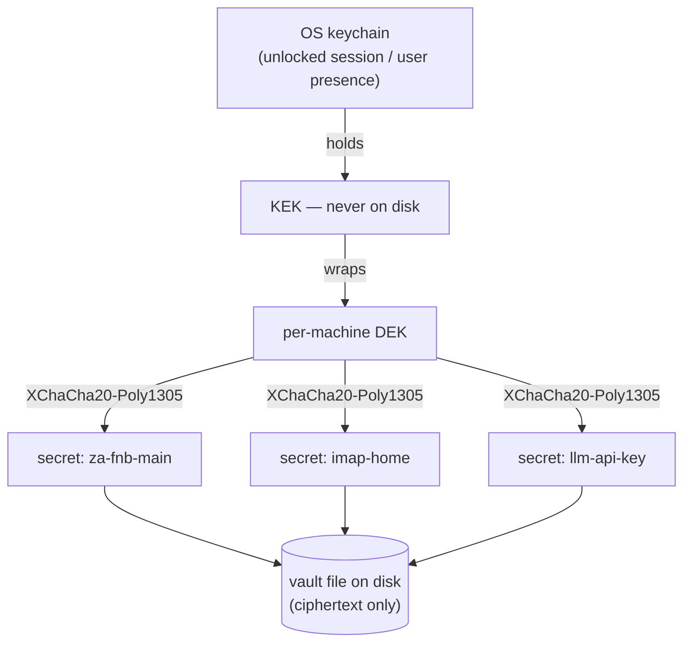

# Threat Model

SlipScan holds the most sensitive credentials a person has — internet-banking logins, mailbox passwords, API keys — on an ordinary personal computer. This document says precisely what protects them, what an attacker gets in each scenario, and which risks remain. No hand-waving: the residual risks are listed at the bottom.

The short version: **a copy of your files yields nothing.** Secrets are only usable inside your unlocked OS session, and even there they are write-only — usable by software, viewable by no one.

## Assets

1. **Credentials** — bank logins, IMAP/app passwords, OAuth refresh tokens, LLM API keys.
2. **Financial data** — the SQLite books and original documents.
3. **Integrity** — of your ledger (audit log) and of installed packs (signatures).

## The credential vault

### Key hierarchy — envelope encryption

Each secret is encrypted with XChaCha20-Poly1305 under a per-machine **data-encryption key (DEK)**. The DEK is wrapped by a **key-encryption key (KEK)** that lives *only* in the OS keychain — macOS Keychain, Windows Credential Manager, or Secret Service on Linux — never on disk in any file SlipScan writes.

Consequence: the vault file, the SQLite books, a full disk image — all of it together is ciphertext without the KEK, and the KEK is only released by *that machine's* OS keychain inside *that user's* unlocked session.

### Write-only semantics

The vault API is `set`, `replace`, `revoke`, and an internal `use_with(name, |secret| ...)` that hands the secret to the consuming adapter inside a closure. There is **no** get-for-display, no export, and no IPC/HTTP operation that returns secret material ([API.md](API.md#what-is-deliberately-absent)). The UI shows metadata only: label, created/rotated timestamps, last-used, and a short non-reversible fingerprint.

This is structural. A phishing screen, a compromised UI component, or a curious household member cannot display a credential, because no code path exists that produces one for display.

### User presence

Where the platform supports it (Touch ID, Windows Hello), unwrapping the KEK for **bank-scraper credentials** requires user presence — a sync can't run without you physically approving it. At minimum, on every platform, use requires the OS session to be unlocked.

### Hygiene, audit, rotation

- **Memory:** secrets are `zeroize`d on drop, held for the shortest possible scope, and excluded from `Debug`/`Display`/logs/errors *by construction* — newtype wrappers with redacted impls, so an accidental `{:?}` prints `[REDACTED]`.
- **Audit:** every vault access (use, set, replace, revoke — never the material) lands in the append-only audit log with timestamp and consumer.
- **Rotation, not editing:** replacing a credential writes a new version and destroys the old ciphertext. There is no in-place edit path, so there is no stale-copy path either.

## Attacker scenarios

| Attacker has… | Gets… |
|---|---|
| Your vault + SQLite files (stolen backup, cloud-synced folder, disposed disk) | **Credentials: nothing** — ciphertext without a KEK that was never on disk. Financial data in the SQLite books: yes, if the media/volume is unencrypted — see residual risks. |
| Your laptop, powered off, disk removed | Same as above, plus whatever full-disk encryption you do or don't run. FileVault/BitLocker/LUKS is your job; SlipScan's vault holds regardless. |
| Your machine, your session, while unlocked | Can make SlipScan *use* credentials (trigger a sync) — each use audited — but still cannot *display* them: write-only is enforced in-process. Bank credentials additionally demand user presence where supported. |
| Network position (your ISP, coffee-shop Wi-Fi) | TLS-protected traffic to endpoints **you** configured, and nothing else — there is no SlipScan server to observe, no telemetry to correlate ([the mantra](ARCHITECTURE.md#non-negotiables-the-mantra)). |
| Runs a benchmark aggregator | Noised, cohort-coarse aggregates from opt-in contributors; DP bounds what any aggregator can learn about an individual ([BENCHMARKS.md](BENCHMARKS.md)). |
| A malicious pack | Rejected unless signed by a publisher **you** trusted; a valid pack can only mis-categorise, never read or exfiltrate ([PACKS.md](PACKS.md)). |

## Residual risks — stated plainly

1. **Malware in your session is game over for use, not for reading.** Code running as you can invoke the vault as SlipScan does and act with your credentials (subject to user-presence prompts). No local-first design survives a compromised session; the vault narrows the blast radius (no display/export, full audit trail) but does not eliminate it.
2. **Financial data is only as private as your disk.** Books are deliberately plain SQLite you can back up and inspect. If your disk or backups are unencrypted, the *data* (not credentials) is readable. Run full-disk encryption; encrypt backups.
3. **The OS keychain is the root of trust.** A platform keychain vulnerability, or a weak login password on an unencrypted machine, undermines the KEK. SlipScan inherits the platform's strength here — deliberately, because the platform keychain is still the best-audited secret store on your machine.
4. **Adapters and extraction providers see what they must.** A bank adapter necessarily handles your bank session; an LLM provider necessarily sees the receipt you send it. Mitigations: adapters are small, open, and auditable ([BANK-ADAPTERS.md](BANK-ADAPTERS.md)); extraction can run fully local via Ollama/llmux ([GETTING-STARTED.md](GETTING-STARTED.md#5-set-an-llm-provider)).
5. **Headless self-host trades presence for convenience.** A server box doing unattended syncs cannot demand Touch ID. Its keychain unlocks with the service session, so machine compromise there is closer to session compromise. Run the box like a server: encrypted disk, minimal services, VPN-only access ([SELFHOST.md](SELFHOST.md)).
6. **DP contribution leaks by budget.** Opt-in benchmark contribution discloses a bounded, noised amount per contribution; the bound is real but nonzero and cumulative. Off by default; the honest accounting is in [BENCHMARKS.md](BENCHMARKS.md#honest-limits).

Found a hole in any of this? Report it — see [SECURITY.md](../SECURITY.md).

---

**Next:** [SCREENSHOTS.md](SCREENSHOTS.md) — a visual tour of the app.
