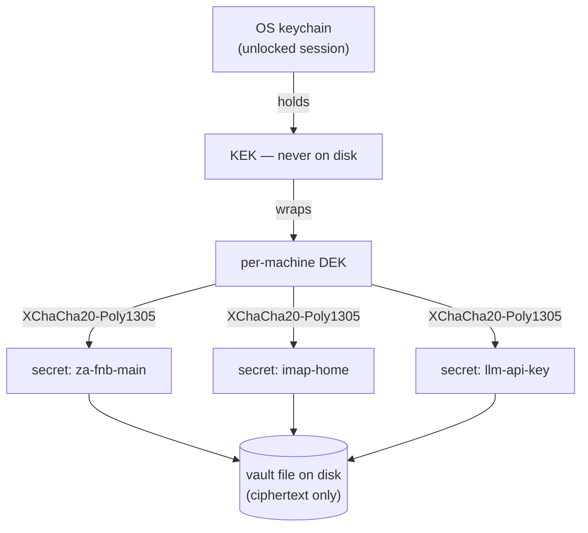

# Threat Model

SlipScan holds the most sensitive credentials a person has — internet-banking logins, mailbox passwords, API keys — on an ordinary personal computer. This document says precisely what protects them, what an attacker gets in each scenario, and which risks remain. No hand-waving: the residual risks are listed at the bottom.

The short version: **a copy of your files yields nothing.** Secrets are only usable inside your unlocked OS session, and even there they are write-only — usable by software, viewable by no one.

## Assets

1. **Credentials** — bank logins, IMAP/app passwords, OAuth refresh tokens, LLM API keys.
2. **Financial data** — the SQLite books and original documents.
3. **Integrity** — of your ledger (audit log), of installed packs (signatures), and of your device pins (below).
4. **Device identity** — this device's ed25519 private key, which lives in the vault like any other secret.

## The credential vault

### Key hierarchy — envelope encryption

Each secret is encrypted with XChaCha20-Poly1305 under a per-machine **data-encryption key (DEK)**. The DEK is wrapped by a **key-encryption key (KEK)** that lives *only* in the OS keychain — macOS Keychain, Windows Credential Manager, or Secret Service on Linux — never on disk in any file SlipScan writes.

```mermaid
flowchart TD
    OS["OS keychain\n(unlocked session)"] -->|holds| KEK["KEK — never on disk"]
    KEK -->|wraps| DEK["per-machine DEK"]
    DEK -->|"XChaCha20-Poly1305"| S1["secret: za-fnb-main"]
    DEK -->|"XChaCha20-Poly1305"| S2["secret: imap-home"]
    DEK -->|"XChaCha20-Poly1305"| S3["secret: llm-api-key"]
    S1 & S2 & S3 --> V[("vault file on disk\n(ciphertext only)")]
```

Consequence: the vault file, the SQLite books, a full disk image — all of it together is ciphertext without the KEK, and the KEK is only released by *that machine's* OS keychain inside *that user's* unlocked session.

### Write-only semantics

The vault API is `set`, `replace`, `revoke`, and an internal `use_with(name, |secret| ...)` that hands the secret to the consuming adapter inside a closure. There is **no** get-for-display, no export, and no IPC/HTTP operation that returns secret material ([API.md](API.md#what-is-deliberately-absent)). The UI shows metadata only: label, created/rotated timestamps, last-used, and a short non-reversible fingerprint.

This is structural. A phishing screen, a compromised UI component, or a curious household member cannot display a credential, because no code path exists that produces one for display.

### User presence — planned, not yet implemented

Today, the guarantee on every platform is: using a secret requires *that machine's* OS keychain inside *that user's* **unlocked session**. There is **no** biometric / user-presence gate yet — the KEK is read from the keychain without an extra prompt. A per-use user-presence requirement for bank-scraper credentials (Touch ID, Windows Hello) is a design goal ([ARCHITECTURE.md](ARCHITECTURE.md)) and is tracked on the roadmap; until it ships, do not rely on it.

### Hygiene, audit, rotation

- **Memory:** secrets are `zeroize`d on drop, held for the shortest possible scope, and excluded from `Debug`/`Display`/logs/errors *by construction* — newtype wrappers with redacted impls, so an accidental `{:?}` prints `[REDACTED]`.
- **Audit:** every vault access (use, set, replace, revoke — never the material) lands in the append-only audit log with a timestamp and entry metadata (name, fingerprint, version). The log does not yet record *which* consumer performed the access.
- **Rotation, not editing:** replacing a credential writes a new version and destroys the old ciphertext. There is no in-place edit path, so there is no stale-copy path either.

## Device identity and pairing

Full model in [NODES.md](NODES.md). **Nothing syncs between devices yet** — this is identity only, so the attack surface below is deliberately small: there is no transport to attack, and a pinned peer is not authorised to do anything, because there is nothing to do.

- **No accounts means no account attacks.** There is no email, password, login, session or reset flow, so there is no credential stuffing, no phishable login page, no password-reset takeover, and no server whose breach hands over your books. The device's ed25519 keypair is generated **on the device**, and nothing is provisioned or escrowed — there is no factory secret for a supply-chain attacker to copy.
- **The private key is a vault secret like any other.** Write-only, envelope-encrypted, zeroized after use, and audited. Everything in [Write-only semantics](#write-only-semantics) applies to it unchanged: it can be created, rotated, revoked and used; it cannot be displayed or exported.
- **What pairing actually authenticates is you.** The blobs are self-signed, so a signature proves possession of the key *in the blob* and nothing about whose key it is. **The out-of-band key-name comparison is the authentication** — nine checksummed words read off the other device's screen. Skipping it (`--unverified`) means pinning whatever arrived, which is why the CLI will not run without one of the two spelled out.
- **A key change is a refusal, never a silent re-pin.** A revoked device is a tombstone and cannot re-pair itself; identity rotation must be signed by the key it replaces; a corrupt pinned key is refused rather than panicked on. The only way to clear a pin is a deliberate **local** reset, which no message, peer or endpoint can reach.
- **Claim tokens are credentials for their lifetime.** An invite blob carries a 256-bit single-use token, stored hashed and expiring in minutes. Anyone who obtains an unredeemed invite can redeem it — and would then be pinned *only if* the person on the other side skips the key-name comparison. Treat an invite like a password until it is redeemed or expires.
- **The pairing ceremony never touches the network.** SlipScan opens no socket to pair, and no route performs it. Nothing in a pairing blob carries a hostname, port or URL, so there is no coordinator to compromise and no endpoint to redirect.

## Attacker scenarios

| Attacker has… | Gets… |
|---|---|
| Your vault + SQLite files (stolen backup, cloud-synced folder, disposed disk) | **Credentials: nothing** — ciphertext without a KEK that was never on disk. Financial data in the SQLite books: yes, if the media/volume is unencrypted — see residual risks. |
| Your laptop, powered off, disk removed | Same as above, plus whatever full-disk encryption you do or don't run. FileVault/BitLocker/LUKS is your job; SlipScan's vault holds regardless. |
| Your machine, your session, while unlocked | Can make SlipScan *use* credentials (trigger a sync) — each use audited — but still cannot *display* them: write-only is enforced in-process. |
| Network position (your ISP, coffee-shop Wi-Fi) | TLS-protected traffic to endpoints **you** configured, and nothing else — there is no SlipScan server to observe, no telemetry to correlate ([the mantra](ARCHITECTURE.md#non-negotiables-the-mantra)). |
| Runs a benchmark aggregator | Nothing today — benchmark *contribution* is not implemented, so no data ever leaves your machine. The designed (unbuilt) pipeline would give an aggregator only noised, cohort-coarse, DP-bounded values ([BENCHMARKS.md](BENCHMARKS.md)). |
| A malicious pack | Rejected unless signed by a publisher **you** trusted; a valid pack can only mis-categorise, never read or exfiltrate ([PACKS.md](PACKS.md)). |
| Substitutes a pairing invite with their own (a hostile paste, a swapped QR) | A perfectly valid invite — from the wrong device. Caught **only** by you comparing the key-name against the other device's screen; skipped by `--unverified`. Even when it succeeds the attacker gains a pin and nothing else: there is no transport and no authorisation model, so a pinned peer can do nothing ([NODES.md](NODES.md#what-pairing-proves--and-what-it-does-not)). |
| Steals an unredeemed invite blob | A single-use, minutes-long claim token. Redeeming it makes them the *accepter*, whom you then pin only if you skip the key-name check. Redeemed or expired, it is inert. |
| A device you revoked, trying to get back in | Refused. Revocation leaves a tombstone, and only a deliberate local `device forget` clears it — a revoked key cannot re-pair itself. |

## Residual risks — stated plainly

1. **Malware in your session is game over for use, not for reading.** Code running as you can invoke the vault as SlipScan does and act with your credentials. No local-first design survives a compromised session; the vault narrows the blast radius (no display/export, full audit trail) but does not eliminate it.
2. **Financial data is only as private as your disk.** Books are deliberately plain SQLite you can back up and inspect. If your disk or backups are unencrypted, the *data* (not credentials) is readable. Run full-disk encryption; encrypt backups.
3. **The OS keychain is the root of trust.** A platform keychain vulnerability, or a weak login password on an unencrypted machine, undermines the KEK. SlipScan inherits the platform's strength here — deliberately, because the platform keychain is still the best-audited secret store on your machine.
4. **Adapters and extraction providers see what they must.** A bank adapter necessarily handles your bank session; an LLM provider necessarily sees the receipt you send it. Mitigations: adapters are small, open, and auditable ([BANK-ADAPTERS.md](BANK-ADAPTERS.md)); extraction can run fully local via Ollama/llmux ([GETTING-STARTED.md](GETTING-STARTED.md#5-set-an-llm-provider)).
5. **Headless self-host trades an unlocked interactive session for convenience.** A server box's keychain unlocks with the service session, so machine compromise there is closer to session compromise. Run the box like a server: encrypted disk, minimal services, VPN-only access ([SELFHOST.md](SELFHOST.md)).
6. **Pairing is trust-on-first-use, and TOFU is only as strong as the comparison.** If you accept a pairing without checking the key-name, you have pinned whatever the channel handed you. SlipScan makes the check enforceable and refuses a mismatch, but it cannot make you look at the other screen. The blast radius is currently nil — there is no transport and no authorisation model, so a wrongly pinned peer can do nothing — but that will change the moment either exists, and a pin made carelessly today is a pin still sitting there then.
7. **A lost device stays pinned until you revoke it.** There is no expiry on a pin, no heartbeat, and no remote wipe. Revocation is a local (or, on a self-host box, an authenticated HTTP) action you have to actually take.
8. **DP contribution would leak by budget — when it exists.** Benchmark contribution is not implemented; if/when it ships it will be opt-in and disclose a bounded, noised amount per contribution — a real but nonzero, cumulative bound. The honest accounting is in [BENCHMARKS.md](BENCHMARKS.md#honest-limits).

Found a hole in any of this? Report it — see [SECURITY.md](../SECURITY.md).

---

**Next:** [SCREENSHOTS.md](SCREENSHOTS.md) — a visual tour of the app.
